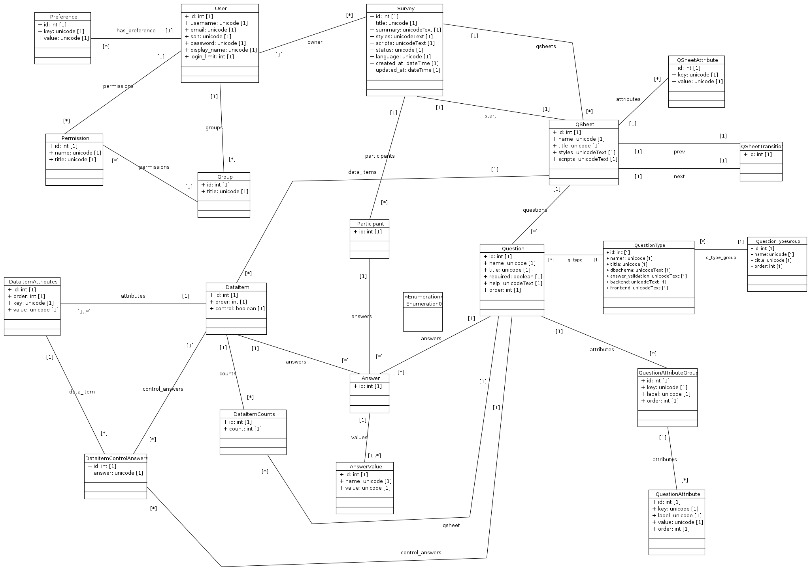

Basic Application Design
========================

Components
----------

The main parts of the  application are roughly structured into two parts. The
*Backend* handles the setting up of the questionnaires and the *Frontend* handles
taking the questionnaire participants through the questionnaire. The *Backend*
functionality is split into four parts:

*Survey*
  The *Survey* component handles setting up of the generic survey-level data and
  populates the *Survey* and *QSheet* tables.

*QSheet*
  The *QSheet* component handles the definition of each individual survey page
  and populates the *QSheet*, *Question*, *QSheetAttribute* and
  *QSheetTransition* tables.

*Data*
  The *Data* component handles the uploading of CSV data that are the source of
  dynamic data sampled and displayed to the user by the *frontend*. It populates
  the *DataItem*, *DataItemAttributes*, and *DataItemControlAnswers* tables.

*Results*
  The *Results* component formats the data provided by the *Frontend* component
  into CSV files for download and analysis.

Database
--------

