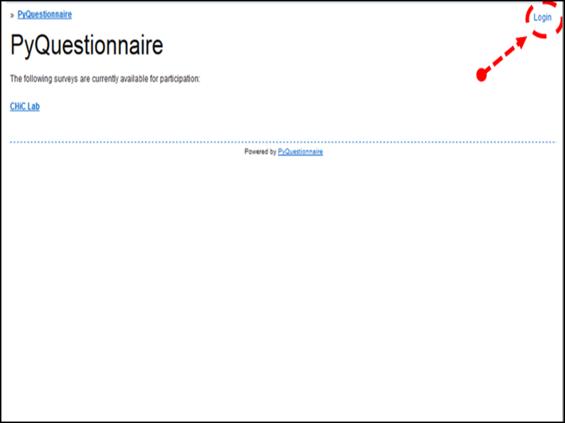
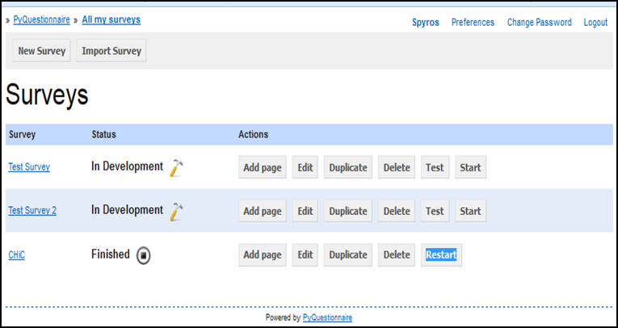

Access PyQuestionnaire
======================
.. Navigation tab

- Access PyQuestionnaire by typing the following address in a web browser of your choice:

  https://promise.sheffield.ac.uk/pyquest/ 
 
- The **Login** screen will then appear:

     
- Click on the **Login** link, indicated by the dashed arrow and circle in the image above.

- In the **Login** screen that appears, enter your username and password.

- The main profile screen will then appear. Any surveys that you create will be listed here, under the title **Surveys**. An example of this screen is shown below:

   
- As mentioned above, the main profile screen automatically appears each time you login in PyQuestionnaire. 
  
  However, if you already are in a survey that you are developing, there are two ways to reach the profile screen:
  
  1. Use the *Breadcrumbs* (:doc:`ref<survey_home_page_elements>`), located on the top left corner of your screen, by clicking on the link *All my surveys*.
  
  2. The other way is to click on the link |allSurveys| , which is part of the *Navigation tabs* (:doc:`ref<survey_home_page_elements>`) located below the *Breadcrumbs* (:doc:`ref<survey_home_page_elements>`).