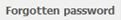
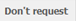
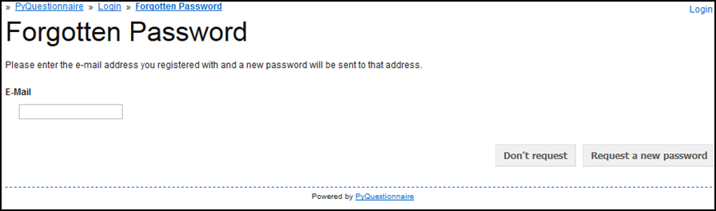

.. _topAccessSection:

************************************
Access the Experiment Support System
************************************

This chapter will demonstrate to you how to access the Experiment Support System and how to navigate it. The next chapter of this manual (*Working with the Experiment Support System*) and that chapter's sections assume that you have read this part first and refer you here as a reminder.

**If you only want to find out how to navigate within the Experiment Support System**, please click :ref:`here<navigating>` to be directed to the relevant section.

.. Navigation tab
.. |allSurveys| image:: ../_static/user/allMySurveysLink.png

How to login to the Experiment Support System
=============================================

- Access the Experiment Support System by typing the following address in a web browser of your choice:

  https://promise.sheffield.ac.uk/pyquest/ 
 
- The **Login** screen will then appear:

.. image:: ../_static/user/loginScreen.png
   :align: center 
     
- Click on the **Login** link, indicated by the dashed arrow and circle in the image above.

- In the **Login** screen that appears, enter your username and password.

- The **main profile screen** (:doc:`ref<conceptsAndTerms>`) will then appear. Any surveys that you create will be listed here, under the title *Surveys*. An example of this screen is shown below:

.. image:: ../_static/user/mainProfileScreen.png
   :align: center 

- If you have forgotten your password, click on the |forgottenPasswordButton| button. This will take you to the **Forgotten Password** screen, an example of which is demonstrated below:

- You will then be prompted to enter an e-mail address where the new password will be send to. Then click on the corresponding button to send the password.

- If you decide, you do not want to request a new button, click on the |dontRequestButton| button.

:ref:`back to the top <topAccessSection>`
   
.. _navigating:

Navigating within the Experiment Support System
===============================================
   
As mentioned above, the **main profile screen** (:doc:`ref<conceptsAndTerms>`) automatically appears each time you login in the Experiment Support System. 
  
However, if you already are in a survey that you are developing, there are two ways to reach the **profile** screen (:doc:`ref<conceptsAndTerms>`):
  
  1. Use the **Breadcrumbs** (:doc:`ref<survey_home_page_elements>`), located on the top left corner of your screen, by clicking on the link **All my surveys**.
  
  2. The other way is to click on the link |allSurveys| , which is part of the **Navigation tabs** (:doc:`ref<survey_home_page_elements>`) located below the **Breadcrumbs** (:doc:`ref<survey_home_page_elements>`).
  

Now, let's assume you are in page 2 of your survey (or any other page for that matter), as shown below, but you want to go to the survey's **Home Page** (:doc:`ref<conceptsAndTerms>`) instead:

  .. image:: ../_static/user/pageTwoScreen.png
     :align: center  
    
  a) Click on the **Survey** tab above the page's title, indicated on the screenshot above with a dashed oval and arrow.
  
  **or**
  
  b) Use the **Breadcrumbs**, above the **Survey** tab, and click on the title of the Survey. In the above example screenshot, the Survey title would be *Chic - Test*.

Then, simply find the survey page you want to move to from the list of pages on the appearing screen and click on its title. 

:ref:`back to the top <topAccessSection>`