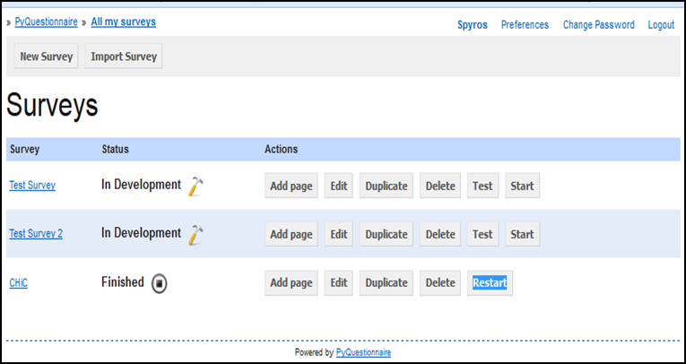
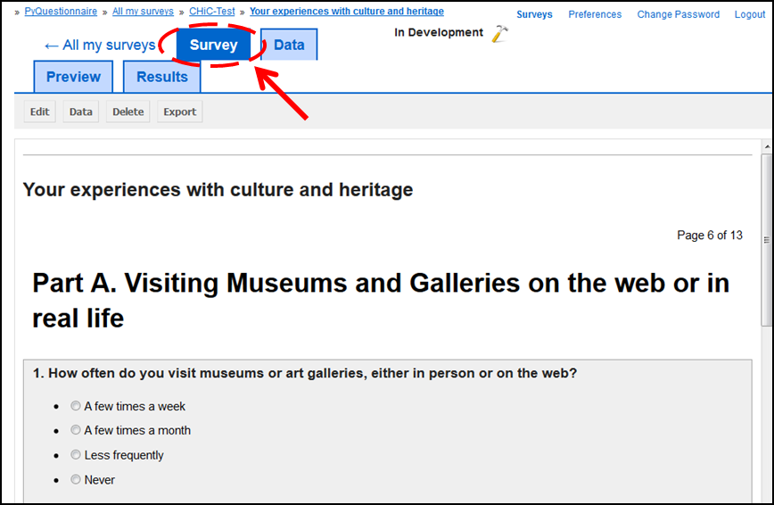

######################
Access PyQuestionnaire
######################

This part will demonstrate to you how to access PyQuestionnaire and how to navigate it. The next part of this manual (*Working with PyQuestionnaire*) and that part's chapters assume that you have read this part first and refer you here as a reminder.

**If you only want to find out how to navigate within PyQuestionnaire**, please click :ref:`here<navigating>` to be directed to the relevant section.

.. Navigation tab
.. |allSurveys| image:: ../_static/user/allMySurveysLink.png

How to login to PyQuestionnaire
===============================

- Access PyQuestionnaire by typing the following address in a web browser of your choice:

  https://promise.sheffield.ac.uk/pyquest/ 
 
- The **Login** screen will then appear:

.. image:: ../_static/user/loginScreen.png
   :align: center 
     
- Click on the **Login** link, indicated by the dashed arrow and circle in the image above.

- In the **Login** screen that appears, enter your username and password.

- The **main profile screen** (:doc:`ref<conceptsAndTerms>`) will then appear. Any surveys that you create will be listed here, under the title *Surveys*. An example of this screen is shown below:

.. _navigating:

Navigating within PyQuestionnaire
=================================
   
As mentioned above, the **main profile screen** (:doc:`ref<conceptsAndTerms>`) automatically appears each time you login in PyQuestionnaire. 
  
However, if you already are in a survey that you are developing, there are two ways to reach the **profile** screen (:doc:`ref<conceptsAndTerms>`):
  
  1. Use the **Breadcrumbs** (:doc:`ref<survey_home_page_elements>`), located on the top left corner of your screen, by clicking on the link **All my surveys**.
  
  2. The other way is to click on the link |allSurveys| , which is part of the **Navigation tabs** (:doc:`ref<survey_home_page_elements>`) located below the **Breadcrumbs** (:doc:`ref<survey_home_page_elements>`).
  

Now, let's assume you are in page 2 of your survey, as shown below, but you want to go to page 1 instead:

   
a) Click on the **Survey** above the page's title.
  
b) Use the **Breadcrumbs**, above the **Survey** button, and click on the title of the Survey. In the above example screenshot, the Survey title would be *Test Survey*.
