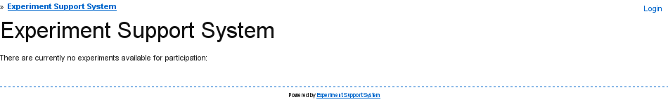

***************************************
Accessing the Experiment Support System
***************************************

To access the Experiment Support System, use your browser to access the URL
at which the administrator has installed the Experiment Support System.

Accessing and Login
===================

After accessing the URL, you will see the landing page in
`figure 1 <#fig-ess-landing>`_. If there are any "live" experiments, then
these will be shown here. More importantly, in the top-right corner, the
login link takes you into the Experiment Support System itself, in order
to set-up or work on experiments.

.. _fig-ess-landing:

   
   **Figure 1**: The landing page of the Experiment Support System. Shows experiments that
   are currently "live" and provides the login functionality.

Following the "Login" link, takes you to the login page
(`figure 2 <#fig-login>`_), where using the username provided by your
administrator and your password you can log into the Experiment Support System.
If you have forgotten your password, then use the "Forgotten password" button
in the bottom right corner to request a new one.

.. _fig-login:

   
   **Figure 2**: The login page including the link to the "Forgotten password" functionality.

General Structure
=================

After logging in you are shown the list of experiments that you have created
previously (`figure 3 <#fig-experiments>`_). If you have not yet created any
experiments, then the list will be empty. `Figure 3 <#fig-experiments>`_ shows
the main layout of the Experiment Support System.

In the top-right corner are a set of links related to your account. The
"Experiments" link will always take you back to this screen. The "Preferences"
link lets you change your account preferences, the "Change Password" link
lets you change your password, and the "Logout" link logs you out of the
Experiment Support System and takes you back to the initial landing page
(`figure 1 <#fig-ess-landing>`_). 

If you have administrative permissions, then in the top-left corner links to
the user, permission group, and question type administration functions are
shown.

Below these sets of links the breadcrumbs document your current location
within the Experiment Support System and can be used to get back to the start,
if you get lost.

Next, the gray bar, is the action bar. This contains the main actions that
are available to you on the current page. Here they are functions to create a
"New Experiment" and to "Import an Experiment" (see :doc:`create_experiment`).

The area below the action bar contains the page's main content, in this case
the list of experiments you have created.

Finally, at the bottom of each page is a link to the Experiment Support
System's documentation.

.. todo: Add links to specific documentation for functions.

.. _fig-experiments:

   
   **Figure 3**: The user experiment landing page showing the experiments you have previously
   created and the functions for creating new and importing existing
   experiments.
   
