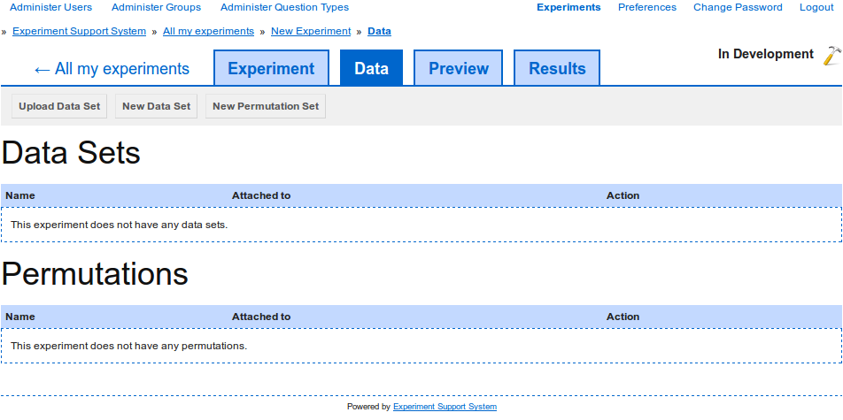
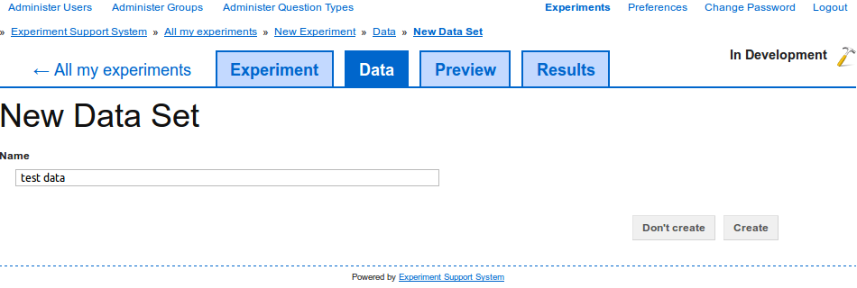
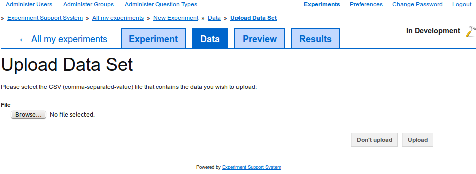
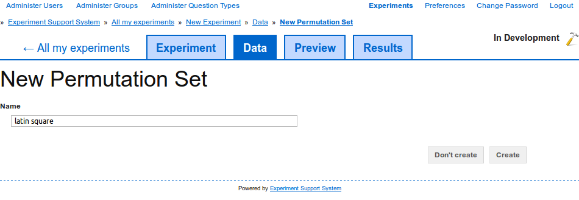

Creating data
-------------

The Experiment Support System allows for dynamic experiment pages through the
use of :term:`data sets`. To create a new :term:`data set`, switch to the
:term:`data set` overview page (`figure 1 <#data-set-overview>`_) by selecting the "Data" tab
at the top of the page.

.. _fig-data-set-overview:

   
   **Figure 1**: Select the "Data" tab to view existing data sets and create
   new ones.

There are two kinds of :term:`data sets`, the standard :term:`data set`, from
which :term:`data items` are sampled, and the :term:`permutation set` which
is used to support latin-square experiments.

Create a new data set
^^^^^^^^^^^^^^^^^^^^^

To create a new :term:`data set`, click on the "New Data Set" button and give
the new :term:`data set` a unique name (`figure 2 <#data-set-new>`_). Then
click on the "Create" button to create the new data set.

.. _fig-data-set-new:

   
   **Figure 2**: Create a new data set by giving it a unique name.

After creating the new :term:`data set`, move on to :doc:`edit_data` to
edit the :term:`data set` keys and :term:`data items`.

Upload an existing data set
^^^^^^^^^^^^^^^^^^^^^^^^^^^

Alternatively, you can upload an existing set of data using a CSV (Comma
Separated Value) file. Click on the "Upload Data Set" button and then add
select the CSV file to upload (`figure 3 <#fig-data-set-upload>`). Click on
the "Browse" button to select the CSV file to upload and then on the "Upload"
button to upload the CSV file and create a new :term:`data set` from the CSV
file.

.. _fig-data-set-upload:

   
   **Figure 3**: Upload a new CSV file 

After uploading the new :term:`data set`, move on to :doc:`edit_data` to edit
the uploaded data.

Create a new permutation set
^^^^^^^^^^^^^^^^^^^^^^^^^^^^

The process for creating a new :term:`permutation set` is the more or less the
same as creating a new :term:`data set`. Click on the "New Permutation Set"
button (`figure 1 <#data-set-overview>`_) and give the new
:term:`permutation set` a unique name (`figure 4 <#permutation-set-new>`_).
Click on the "Create" button to create a new :term:`permutation set`.

.. _fig-permutation-set-new:

   
   **Figure 3**: Create a new permutation set and give it a unique name. 

After creating the new :term:`permutation set`, move on to
:doc:`edit_permutation` to edit the :term:`permutation set`'s settings.
