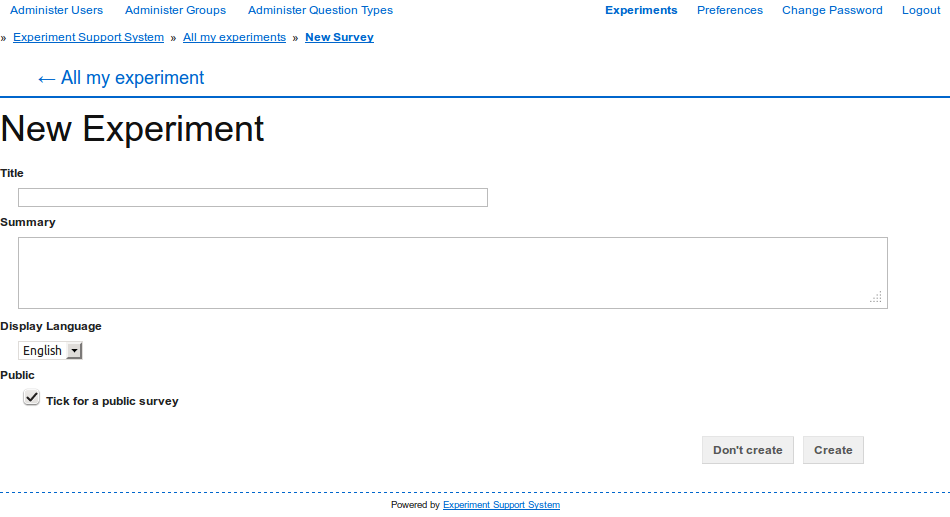
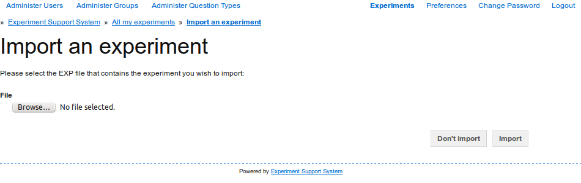

Creating an Experiment
======================

There are two ways of creating an experiment. You can either create a new
experiment from scratch or import an existing experiment and then modify that.

Creating a new Experiment
-------------------------

To create a new experiment, click on the
"New Experiment" button on the list of experiments page
(see :doc:`access_ess`). On the "New Experiment" page
(:num:`figure #fig-new-experiment`) you provide the new experiment's title
and other settings:

**Title**
  The title is used to identify the experiment and shown on the main landing
  page
  
**Description**
  If the experiment is publicly available, then this description is shown
  to prospective participants so that they have an idea of what they experiment
  is about
  
**Display Language**
  The language that is used in the experiment participants' interface.
  Currently only English is supported.

**Public**
  Tick the checkbox to have your experiment show up on the main landing page
  when you run it.

  
.. _fig-new-experiment:

   
   On the "New Experiment" page, you specify the new experiment's basic
   settings. 

Click on the "Create" button to create the new experiment and be taken to the
experiment construction and editing page (see :doc:`edit_experiment`).

.. todo: Add inter-document links

Importing an existing Experiment
--------------------------------

The second method for setting up a new experiment is to import an existing
experiment and then to modify that to create the desired experiment. To
import an experiment, click on the "Import Experiment" button on the list
of experiments page (see :doc:`access_ess`). 

On the importing page (:num:`figure #fig-import-experiment`) select the
experiment file you wish to import and then click on the "Import" button to
start the import. After the experiment has been imported, you will be taken to
the experiment construction and editing page (see :doc:`edit_experiment`),
where you can edit and modify the imported experiment. 

.. _fig-import-experiment:

   
   Select the experiment file to import and then click on the "Import"
   button to import the experiment.

