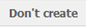
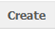
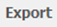
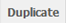
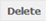
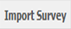
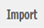
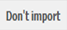
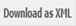

.. note::
	
   The following sub-section assumes that you now know how to navigate to a specific survey on the relevant list or to a specific question in that survey. If you are not sure how to do this, please refer to the section *Navigating within PyQuestionnaire*, located at the bottom-half of the chapter :doc:`Access PyQuestionnaire<access_Questionnaire>`.

.. manipulation buttons

.. |browseButton| image:: ../_static/user/browseButton.png

.. |edit| image:: ../_static/user/editButton.png
.. |update| image:: ../_static/user/updateButton.png
.. |dontUpdate| image:: ../_static/user/dontUpdateButton.png

.. _topCreateSurveySection: 

Creating or importing a new survey
==================================

This chapter explains how to create a new survey from scratch, using the tools that the system provides, or import a survey that you have previously developed in XML code.

To find out how to:

	- create a survey, please click :ref:`here<createSurveysub-Section>`

	- import a previously developed survey, click :ref:`here<importSurveysub-Section>`

.. _createSurveysub-Section:

How to create a survey
----------------------

   - Click on the |newSurveyButton| button on the top left of the Survey screen.

   - The **New Survey** Screen will appear, as shown below: 

     .. image:: ../_static/user/newSurveyScreen.png
        :align: center 
   
   - Enter appropriate information in the fields *Title* and *Summary*.  

   - Choose the language that your survey will be diplayed in from the drop-down menu, entitled *Display Language*, below the field *Summary*.
   
   - Tick in the box under the title *Public*, if you want the survey to be public.

   - Following the above, click on the button |create| to create the required survey or on the button |dontCreate|, if you decide that you do not require the survey anymore.

   - Upon creation of the survey, you will be directed to the **home page** (:doc:`ref<conceptsAndTerms>`) of that survey, as shown below. Note that your newly created survey will obviously not contain any pages initially(as is shown in the screenshot below):
 
     .. image:: ../_static/user/originalHomePageSurveyScreen.png
        :align: center 
		
:ref:`back to the top <topCreateSurveySection>`

.. _importSurveysub-Section:

How to import a survey
----------------------
The system allows you to write a survey in XML code and upload it on your PyQuestionnaire profile, instead of using the system's GUI to develop it. You can import a survey by carrying out the following steps:

- If you are not already there, navigate to the **main profile screen** (:doc:`ref<conceptsAndTerms>`) and then follow the instructions below - see **Note** at the top of this section.

- If you are on the **main profile screen** (:doc:`ref<conceptsAndTerms>`)
   
  a) Click on the |importSurvey| button, located on the top left corner of the screen.

  b) This will take you to the **Import a Survey** screen, shown below:
     
  .. image:: ../_static/user/importSurveyScreen.png
     :align: center
		
  c) You then click on the |browseButton| button and navigate to the XML file you want to import in your profile.
	
  d) When you find and select the required file, click on the |importButton| button, if you decide that want to import it, or on the |dontImportButton| button, if you decide you want to discard it.
	
  e) The survey you have just imported will now appear in the list of surveys of your **main profile screen** (:doc:`ref<conceptsAndTerms>`).
	
  f) You can then manipulate the imported survey in the same way that you do with surveys setup with the use of the PyQuestionnaire.

:ref:`back to the top <topCreateSurveySection>`