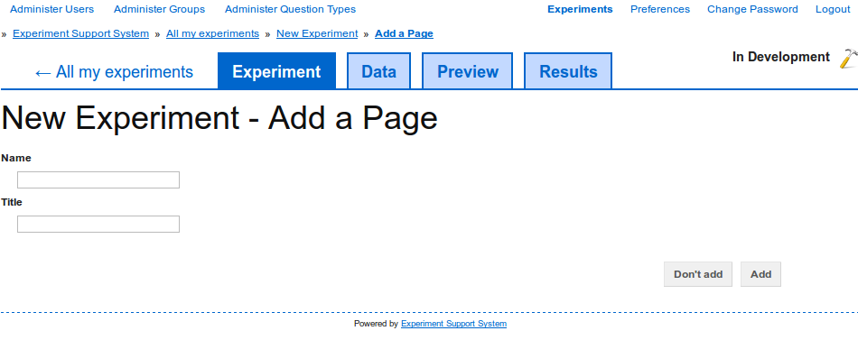

Create a page
-------------

To create a new :term:`page` and add it to the :term:`experiment`, you can
either create a completely new page from scratch or import an existing page.

Add a new page
^^^^^^^^^^^^^^

To add a completely new page, on the experiment overview page, click on the
"Add page" button in the toolbar. You are then shown the "Add a Page" page
(:num:`figure #fig-new-page`).

.. _fig-new-page:

   
   Specify a name and a title to create a new page and add it to the
   :term:`experiment`.

To add the new page, specify the page's name and title. The name is used to
identify the :term:`page` within the :term:`experiment` and must thus be
unique. The title is displayed to :term:`participants` when they participate
in the experiment and can be empty if you do not want to show a title.

Click on the "Add" button to create the new page and add it to the
experiment. After clicking on this button, you are taken to the page editing
interface (see :doc:`edit_page`).

Clicking on on the "Don't add" button takes you back to the experiment
overview page without creating a new page.

Import an existing page
^^^^^^^^^^^^^^^^^^^^^^^

To import an existing page, on the experiment overview page, click on the
"Import page" button in the toolbar. You are then shown the "Import page"
interface (:num:`figure #fig-import-page`).

.. _fig-import-page:

.. _fig-new-page:

   
   To import an existing page, simply select the page's file and add it to
   the :term:`experiment`.

Click on the "Browse" button to select the page file to import. After
selecting a file, click on the "Import" button to import the page into the
:term:`experiment`. After the page has been imported you are taken to the
page editing interface (see :doc:`edit_page`).

Clicking on on the "Don't import" button takes you back to the experiment
overview page without importing a page.
