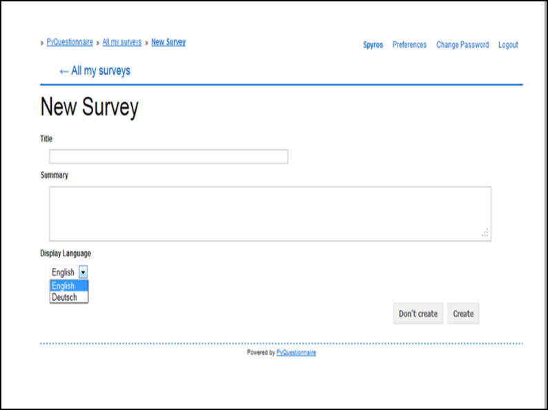
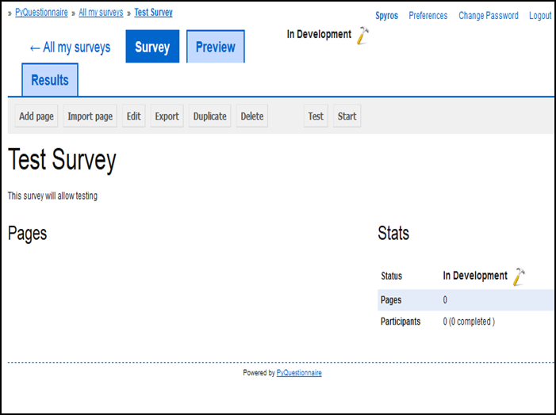

Creating a survey
-----------------
This section explains how to create a new survey.
 
- Click on the **New Survey** button on the top left of the Survey screen.

- The **New Survey** Screen will appear, as shown below: 

   
- Enter appropriate information in the fields *Title* and *Summary*.  

- Choose the language that your survey will be diplayed in from the drop-down menu, entitled *Display Language*, below the field *Summary*. Two options are available: English and Deutsch.

- Following the above, click on the button **Create** to create the required survey or on the button **Don't create**, if you decide that you do not require the survey anymore.

- Upon creation of the survey, you will be directed to the **home page** of that survey, as shown below:
 

 
In the next section of the manual, we will present and explain the different elements of the Survey home page, as this will allow you to better understand the sets of instructions that follow and will assist you in familiarising yourself with the architecture of the home page.