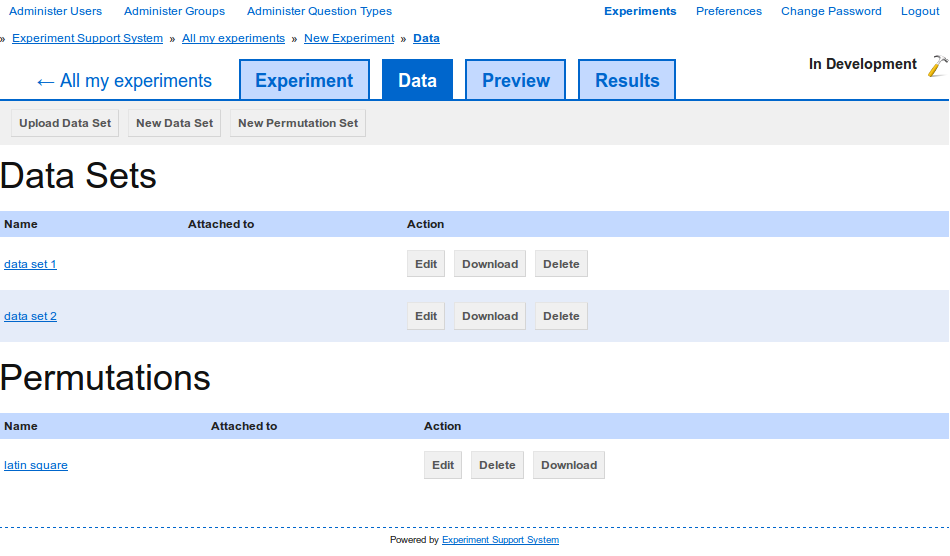

Delete data
-----------

To delete :term:`data sets` or :term:`permutation sets`, select the "Data" tab
(`figure 1 <#data-set-delete>`_). Then click on the "Delete" button next to the
:term:`data set` or :term:`permutation set` you want to delete.

.. _fig-data-set-delete:

   
   **Figure 1**: Select the "Data" tab to view existing data sets and delete
   them.

You will be asked to confirm the deletion, as the process is irreversible.
If you used the data set on any page, then that link will automatically be
removed.
