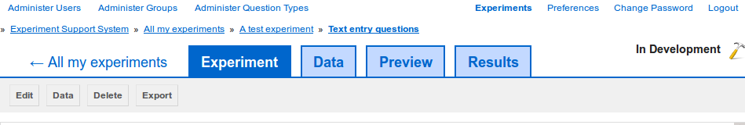

Delete a page
-------------

To delete a :term:`page` from an :term:`experiment`, go to the page's preview
(`figure 1 <#fig-delete-page>`_) and then click on the "Delete" button.

.. _fig-delete-page:

   
   **Figure 1**: To delete the current page, click on the "Delete" button in
   the :term:`page` preview.

You will be asked to confirm that you wish to continue with deleting the page,
as the deleting process is *irreversible*.