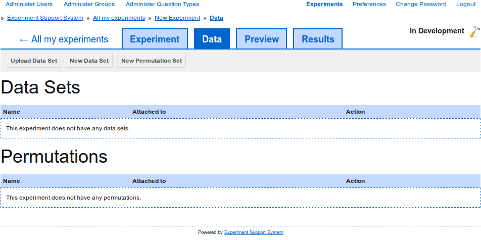

Editing a data set
------------------

A :term:`data set` consists of the `keys` that define the attributes that
each :term:`data item` has and the actual :term:`data items`. Both can be
edited independently.

.. _fig-data-set-list:

   
   **Figure 1**: To edit the keys of a data set, click on the "Edit" button
   for the data set you want to edit. To edit data items click on the title
   of the data set.

Edit the data set's keys
^^^^^^^^^^^^^^^^^^^^^^^^

To add keys to a :term:`data set`, click on the "Edit" button next to the
:term:`data set` you want to edit (`figure 1 <#data-set-list>`_). On the edit
page (`figure 2 <#data-set-edit-keys>`_) use the "+" and "-" buttons to add or
remove keys from the :term:`data set`. 

.. _fig-data-set-edit-keys:

   
   **Figure 2**: To add a key to the data set, click on the "+" button. To
   remove a key, click on the "-" button next to the key you wish to delete.

To add a new key to the :term:`data set`, click on the "+" button. Then type
the new key's label into the text box. If the :term:`data set` has
:term:`data items`, then each :term:`data item` will be assigned an empty
value for that key.

To remove a key from the :term:`data set`, click on the "-" button next to the
key you want to remove. If the :term:`data set` has :term:`data items`, then
the values for that key will be removed from all :term:`data items`.

To save the changes you have made to the data set's keys, click on the
"Update" button.

Adding data items to the data set
^^^^^^^^^^^^^^^^^^^^^^^^^^^^^^^^^

To add a :term:`data item` to a :term:`data set`, click on the title of the
:term:`data set` in the data set overview (`figure 1 <#data-set-list>`_) to go
to the list of :term:`data items` (`figure 3 <#data-set-edit>`_).

.. _fig-data-set-edit:

   
   **Figure 3**: The data set view lists all data items assigned to the data
   set.

To add an additional :term:`data item` to the :term:`data set`, click on the
"Add Item" button to get to the :term:`data item` editing page
(`figure 4 <#data-set-add-item>`_).

.. _fig-data-set-add-item:

   
   **Figure 4**: The number of values you need to enter depends on the number
   of keys defined on the :term:`data set`.

For each key defined on the :term:`data set`, an input field is provided. Enter
the values for the :term:`data item` you wish to add and click on the "Add"
button.

:term:`Data items` can be marked as :term:`control items` by selecting the
"Control Item" checkbox. :term:`Control items` are used to filter participatns
who are answering the questions randomly or without considering the actual
question. This is achieved by specifying the correct response to a question
for the :term:`control items`, when the :term:`data set` is linked to a
:term:`page` (see :doc:`link_data_set`). Then, when the participants work
through the experiment, the Experiment Support System can check the
participants' responses to the correct response. To ensure that this does not
flag up participants who are treating the experiment seriously, the correct
response for a :term:`control item` must be obvious. When :term:`data items`
are sampled for display, the number of :term:`data items` and
:term:`control items` can be specified separately, ensuring that each
:term:`page` displays the specified number of :term:`control items` to each
participant.

Removing data items from a data set
^^^^^^^^^^^^^^^^^^^^^^^^^^^^^^^^^^^

To remove a :term:`data item` from a :term:`data set`, click on the "Delete"
button for the :term:`data item` you wish to delete
(:ref:`figure 3 <fig-data-set-edit>`). You will be asked to confirm the action,
as it is irreversible.
