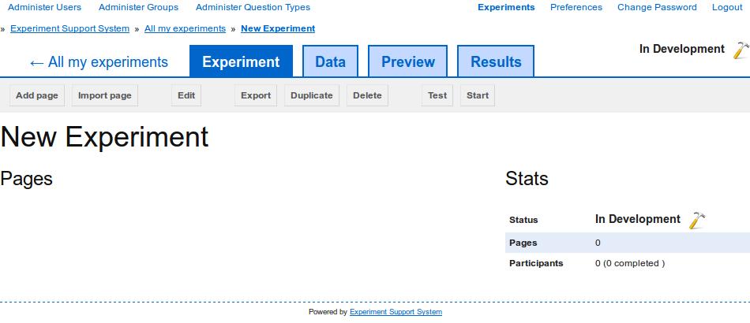

Editing an Experiment
=====================

After creating a new, importing an existing, or selecting to edit a previously
created experiment, you are taken to the experiment overview page
(:num:`figure #fig-experiment-overview`).

.. _fig-experiment-overview:

   
   After creating a new, importing an existing, or selecting to edit a
   previously created experiment, you are shown the experiment overview
   page.

From here you can access and modify all of the experiment's aspects. The four
main tabs are:

**Experiment**
  In this tab you find all the functions for editing the :term:`experiment`'s
  individual :term:`pages` and connecting them together to produce the final
  experiment.

**Data**
  In this tab you can create and upload :term:`data sets` that can then in
  turn be used in the experiment's :term:`pages` to create complex,
  data-driven :term:`experiments`.

**Preview**
  The preview tab provides a preview of all the :term:`pages` in the
  :term`experiment` in their approximate order.

**Results**
  The results tab provides access to the :term:`participants`' responses to
  the :term:`questions` on the :term`experiment`'s :term:`pages`.

On the right next to the four main tabs, the :term:`experiment`'s current
status is displayed. If you hover over the status, options for changing the
:term:`experiment`'s status are shown.

In the main area on the left, the :term:`experiment`'s :term:`pages` are
listed and via that list :term:`pages` can be edited or deleted. The box on
the right gives a brief overview over the current state of the
:term:`experiment`, particularly useful when the experiment is being run.

Further details on the available editing functions can be found in the
following sections:

.. toctree::
   :maxdepth: 2
   
   edit_settings
   delete_experiment
   create_page
   edit_page
   preview_page
   delete_page
   create_data
   edit_data
   delete_data
   