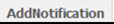
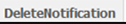

.. _topEditExportSurveySection:

.. note::
	
   The following sub-section assumes that you now know how to navigate to a specific survey on the relevant list or to a specific question in that survey. If you are not sure how to do this, please refer to the section *Navigating within PyQuestionnaire*, located at the bottom-half of the chapter :doc:`Access PyQuestionnaire<access_Questionnaire>`.

Editing, exporting, duplicating and deleting an existing survey
--------------------------------------------------------------------------
.. manipulation buttons
.. |export| image:: ../_static/user/exportButton.png
.. |duplicate| image:: ../_static/user/duplicateButton.png
.. |delete| image:: ../_static/user/deleteButton.png
.. |browseButton| image:: ../_static/user/browseButton.png
.. |downloadXML| image:: ../_static/user/downloadXML.png   
.. |edit| image:: ../_static/user/editButton.png
.. |update| image:: ../_static/user/updateButton.png
.. |dontUpdate| image:: ../_static/user/dontUpdateButton.png

   
This sub-section explains how to:

1. editing a survey - go to relevant sub-subsection by clicking :ref:`here<editingSurveySub-subsection>`. 

2. export a survey - go to relevant sub-subsection by clicking :ref:`here<exportSurveySub-subsection>`. 

3. duplicate a survey - go to relevant sub-subsection by clicking :ref:`here<duplicateSurveySub-subsection>`.

4. delete a survey - go to relevant sub-subsection by clicking :ref:`here<deleteSurveySub-subsection>`. 
  
.. _editingSurveySub-subsection:

Editing a survey
^^^^^^^^^^^^^^^^
You can edit the details of a survey you are developing, add your own CSS Styles and JavaScript code, change which of the survey pages will be the first to display, add notifications depending on specific conditions and make the survey public. 

Depending on where you are in the system, there are three ways to do the above, detailed below as (a), (b) and (c):

	(a) **If you are not already in the survey you want to edit**, navigate to the **main profile screen** (:doc:`ref<conceptsAndTerms>`), as demonstrated in the *Access PyQuestionnaire* section earlier (:doc:`ref<access_Questionnaire>`).

	(b) **When you reach or if you are on the main profile screen** (:doc:`ref<conceptsAndTerms>`), click on the |edit| button, next to the survey you want to edit.

		- This will take you to the **Edit** screen, shown below:

		.. image:: ../_static/user/editSurveyScreen.png
		   :align: center
   
		- On that screen, amend any field details according to your needs. 

		- By clicking on the links **CSS Styles** and **Javascript**, two boxes will appear, allowing you to type your own CSS Styles or JavaScript code respectively.

		- You can also change which of your survey pages will be the first page, by selecting one from the dropdown menu under the title **First page**.
	
		- Further to the above, you can add a notification to be sent to your e-mail either every so many days or when the number of participants reaches a specific threshold.
	
		- You can do the above by:
		
		  1. adding your e-mail address in the field *Notify* under the title **Notifications**.
	  
		  2. then clicking on the drop-down menu as shown in the screenshot below:
	  
		  .. image:: ../_static/user/notificationsExample.png
		
		  3. choosing the number of days or participants that will trigger the notification. The notification will now added and stay on the list of notifications you have created.
	  
		  4. clicking on the |addNotificationButton| button to add another notification or the |deleteNotificationButton| button to delete the notification you have just created.

		- When you are happy with the changes you made, click on the |update| button. Otherwise, click on the |dontUpdate| button. In any case, you will be re-directed to the **home page** (:doc:`ref<conceptsAndTerms>`)  of the survey you are developing.
	
	(c). **If you already are in the survey you need to edit**, click on the |edit| button of the **Manipulation buttons**, above the title of the survey. Then, simply follow the steps of option (b) mentioned above.
	
:ref:`back to the top <topEditExportSurveySection>`

.. _exportSurveySub-subsection:

Exporting a survey
^^^^^^^^^^^^^^^^^^
You can export a survey by downloading its XML code in your files. To do this, you need to carry out the following steps:

- If you are not already in the required survey, navigate to your list of surveys in the **main profile screen** (:doc:`ref<conceptsAndTerms>`), as described further above.

  a) When you are in the survey you want to export, click on the |export| button, included in the **Manipulation buttons** (:doc:`ref<survey_home_page_elements>`) of that screen.
   
  b) The **Export** screen will appear as shown below:

  .. image:: ../_static/user/exportScreen.png
     :align: center
	   
  c) In that screen, click on the |downloadXML| button, for the relevant XML code to appear in your browser.

:ref:`back to the top <topEditExportSurveySection>`
 
.. _duplicateSurveySub-subsection:

Duplicating a survey
^^^^^^^^^^^^^^^^^^^^
If you have a survey that is a good basis for further surveys to be developed on or if you want to test ideas you might have regarding the possible development paths you could follow without messing up the original survey, PyQuestionnaire allows you to duplicate it.

In order to action the above, follow the steps below:

- If you are on the **main profile screen** (:doc:`ref<conceptsAndTerms>`)
 
  a) click on the |duplicate| button, next to the survey you want to duplicate. 
  
  b) the **Duplicate** screen will appear, as illustrated below:

  .. image:: ../_static/user/duplicateScreen.png
	 :align: center

  c) change the survey title in the field *Title* to avoid confusion with the original survey.
  
  d) click on the |duplicate| button again.
  
  e) you will then be directed to the **home page** (:doc:`ref<conceptsAndTerms>`) of the duplicated survey.
  
  f) the duplicated survey will now appear in the list of surveys of your **main profile screen**  (:doc:`ref<conceptsAndTerms>`).

----------------------------------------------------------------------------------------------------------------------------------------
  
- If you are not already on the **main profile screen**  (:doc:`ref<conceptsAndTerms>`) but are in a different survey to the one you want to duplicate

  a) navigate to the **main profile screen** (:doc:`ref<conceptsAndTerms>`) - see **Note** at the top of this section.
  
  b) follow the steps described above in the previous sub-section.

----------------------------------------------------------------------------------------------------------------------------------------

- If you are in the survey that you want to duplicate

  a) click on the |duplicate| button, included in the **Manipulation buttons** (:doc:`ref<survey_home_page_elements>`) of that screen.
  
  b) follow steps *b* to *f* described above in the first sub-section above, relevant to *duplicating a survey*.

:ref:`back to the top <topEditExportSurveySection>`
  
.. _deleteSurveySub-subsection:

Deleting a survey
^^^^^^^^^^^^^^^^^
To delete a survey, follow the steps below:

- If you are on the **main profile screen**  (:doc:`ref<conceptsAndTerms>`)

  a) click on the |delete| button, next to the survey you want to delete. 
   
  b) a message will appear asking you to confirm that you want to delete the selected survey, including its pages, data and results.

  c) click **OK** and that survey will disappear from your list. 
 
-----------------------------------------------------------------------------------------------------------------------------------------
 
- If you are not already on the **main profile screen**  (:doc:`ref<conceptsAndTerms>`), but are in a different survey to the one you want to delete

  a) navigate to the **main profile screen** (:doc:`ref<conceptsAndTerms>`) - see **Note** at the top of this section.
  
  b) follow the steps described above in the previous sub-section.

-----------------------------------------------------------------------------------------------------------------------------------------

- If you are in the survey that you want to delete

  a) click on the |delete| button, included in the **Manipulation buttons** (:doc:`ref<survey_home_page_elements>`) of that screen.
  
  b) follow the steps described above in the first sub-section above, relevant to *deleting a survey*.
  
:ref:`back to the top <topEditExportSurveySection>`