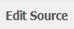
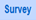
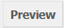

.. _topSection:

.. note::
	
   The following section assumes that you now know how to navigate to a specific survey on the relevant list or to a specific question in that survey. If you are not sure how to do this, please refer to the sub-section *Navigating within PyQuestionnaire*, located at the bottom-half of the section :doc:`Access PyQuestionnaire<access_Questionnaire>`. 
   
   It is also assumed that you know how to add a survey page to a new survey you are developing. More details regarding this, can be found in the section :doc:`Adding a new survey page <add_page>`.
   
   
.. |add| image:: ../_static/user/add.png

.. |edit| image:: ../_static/user/editButton.png
.. |Settings| image:: ../_static/user/settingsButton.png
.. |Layout| image:: ../_static/user/layoutButton.png
.. |editGraphically| image:: ../_static/user/editGraphicallyButton.png
.. |results| image:: ../_static/user/resultsButton.png
.. |update| image:: ../_static/user/updateButton.png
.. |dontUpdate| image:: ../_static/user/dontUpdateButton.png
.. |updated| image:: ../_static/user/updatedButton.png

.. |testValidation| image:: ../_static/user/testValidation.png

   
Editing an existing survey page
-------------------------------

This section explains how to edit an existing survey. This can be done in two ways:

1. Edit the survey graphically - go to relevant section by clicking :ref:`here <graphicEditSection>`.

2. Edit the source of the survey - go to relevant section by clicking :ref:`here <sourceEditSection>`. 

.. _graphicEditSection:

Edit graphically 
================
There are two sets of steps to edit a survey page graphically, depending on where in the system you are:

1. Let's assume that you have just created a new survey and have added a new page, as shown in the section :doc:`Adding a new survey page <add_page>`. You should now be in the **Edit** screen shown below:
  
   .. image:: ../_static/user/pageEditScreen.png   
      :align: center

Notice that on the screenshot shown above, the |Layout| button is dark blue, whereas the |Settings| button is light blue. This indicates that, by default, you are on the **Layout** screen. If you click on the |Settings| button, you will be directed to the **Settings** screen, as demonstrated below, and the background colours of the mentioned buttons will reverse, i.e. |Layout| button now has a light blue background etc:
   
   .. image:: ../_static/user/settingsScreen.png
      :align: center

  **1.1)** When you are directed to the **Layout** screen for the first time, the following message appears:
      
	       .. image:: ../_static/user/dragElementsMessage.png
                   :align: center
				  
  **1.2)** The elements the message refers to, are included in a list on the right-hand side of your screen, as illustrated in the example below:
		   .. image:: ../_static/user/elementsList.png
				   :align: center
				   
  **1.3)** The list above includes the following types of elements, distinguished in three categories:
           
		1.3.1) **Informative**
		     
			   * *Text*: this element allows the presentation of useful information to the participants about the survey, a survey page or a particular question. By double-clicking within the elements box, you are presented with the following **Edit** window, with similar options to those provided by a standard word editor:
			 
			     .. image:: ../_static/user/editTextWindow.png
			             :align: center
		
		1.3.2) **Input**
		
				 * *Single-line text input*: where the participants can type a single-line response in free text.
				 * *Multi-line text input*: where the participants can type more than one lines in free text.
				 * *Number input*: where participants can type a number, within a minimum and maximum value defined by you.
				 * *E-mail input*: where participants can type their e-mail address.
				 * *URL input*: where participants are allow to type a URL, starting with *https://*.
				 *

		1.3.3) **Choice**
			
                
				
	       .. hint:: Most types of elements have the following fields in common: 
		             
					 1. Name, 
					 2. Title, 
					 3. Help box: where you can provide the participant with information that will help them respond to a survey question
					 4. Required-This question must be answered checkbox: this will ensure that the participant answers a survey question before progressing to the next one
			
  **1.3)** Go through the list of elements, left-click on the element you need and drag it to the left, until you see a rectangular with dotted lines appearing below the above mentioned message. An example of this is shown in the screenshot below:
  
           .. image:: ../_static/user/dragElementScreen.png
                   :align: center
  
  **1.4)** Depending on the element you choose, you will either need to double-click within the edit area of the element (an example of this is the element *Text*, shown in the above picture) or start typing the information required in the relevant fields (all other elements on the list use this approach).
  
  **1.3)** Now click on the |Settings| button to be directed to the **Settings** screen, mentioned above.
   
  **1.3)** On this screen, you can change the *Name* and the *Title* of the survey page according to your experiment's needs. Note that the field *Name* refers to the name of the element, that is the specific survey page you are viewing at any given time, whereas the field *Title* refers to the actual question that appears on that page. An example of this is provided with the screenshot below, with the relevant fields enclosed in rectangular with dotted borders:
   
           .. image:: ../_static/user/nameTitleExample.png 
                   :align: center  
   
      The element's name will be used to refer to the relevant question, when you export a survey's results, as shown in the sub-section **Downloading data** of the section :doc:`Downloading, uploading and clearing data <get_data>`. For example, using the above screenshot, if you clicked on the |results| button, you would get the following screen:
   
           .. image:: ../_static/user/ nameTitleExampleResults.png 
                   :align: center  
   
      For a more detailed explanation of the **Results** screen, refer to sub-section **Downloading data** of the section :doc:`Downloading, uploading and clearing data <get_data>`.
   
  **1.4)** On the **Settings** screen, you can also:
   
	       - Choose the type of question asked, for example whether it would be a *single* or a *repeated* question.
	       - Add data items.
	       - Make the question a *Control Item* (see :doc:`here <conceptsAndTerms>` for a definition of this).			
	       - Choose whether you would like the question numbers to be shown, by using the drop-down menu of the field *Show Question Numbers*.			
	       - Which survey page should be the next from the one you are currently viewing, by using the drop-down menu of the field *Transition to*.			
	       - Add your own CSS Styles by clicking on the link *CSS styles* below the *Transition to* menu and typing in the box that appears. Clicking on the link again will make the text box disappear, but keep the text you have just added.			
	       - Add your own code in JavaScript by clicking on the link *Javascript* below the link *CSS styles* and typing in the box that appears. As with *CSS Styles*, clicking on the *Javascript* link again will make the text box disappear, but keep the text you have just added.

  **1.5)** Following any changes you carried out on a survey page, it is a good idea to validate these in order to make sure that everything will work fine when the survey is actually running. To do this, click on the |preview| button located above the survey page's title.
	
  **1.6)** By doing this, you will be directed to the **Preview** screen of that page, where you will be presented with an example of how the page will look like in the live survey.
	
  **1.7)** On the **Validation** screen, you can test questions by providing combinations of replies (checking boxes, typing free text etc.) in order to ensure that responses that do not follow the conditions you set for a specific question, are not permitted.
	
  **1.8)** When you are done completing a preview question, click on the |testValidation| button as indicated in the example screenshot below:
	       .. image:: ../_static/user/testValidationScreen.png 
                   :align: center

  **1.9)** If you have completed the preview question appropriately, the following message will appear below the title of the survey page:
  
           .. image:: ../_static/user/successValidation.png 
                   :align: center
  
       Otherwise, you will get an error message like the one below:
	   
	       .. image:: ../_static/user/failValidation.png 
                   :align: center 
  
  **1.10)** Once you have finished testing a survey page, in order to navigate away from it and back to the **home page** (:doc:`ref<conceptsAndTerms>`) screen, click on the |surveyButton| tab, one of the **Navigation tabs** (:doc:`ref<survey_home_page_elements>`), located above the survey page's title.
 

:ref:`back to the top <topSection>`
   
------------------------------------------------------------------------------------------------------------------------------------------------------------------------

2. If you are on the survey's **home page** (:doc:`ref<conceptsAndTerms>`) and not on the survey page you want to edit, then click on the |edit| button, located under the title and listed characteristics of that page. You will then be directed to the **Edit** screen, an example of which is provided further above. Now simply follow the steps described in sub-section (1) above to edit a survey page graphically.

   
:ref:`back to the top <topSection>`

.. _sourceEditSection:

Edit source
===========
The way to access this option depends on whether you are on the survey's **home page** (:doc:`ref<conceptsAndTerms>`) or the actual survey page you want to edit. 

1. If you are on the survey's **home page** (:doc:`ref<conceptsAndTerms>`), follow the instructions provided in sub-section (2) of the :ref:`Edit graphically<graphicEditSection>` section above.
	
2. If you are on the actual survey page you want to edit, that is on the **Edit** screen of the page (see screenshot in :ref:`Edit graphically<graphicEditSection>` section), click on the |editSource| button, above the title of the survey page:

 **2.1)** You will now be directed to the **Edit Source** screen, as demonstrated below. This screen is the same as the **Settings** screen mentioned in the ref:`Edit graphically<graphicEditSection>` section above, except from the textbox *Content* that the **Settings** screen does not have. The first screenshot corresponds to the top part of the screen. Notice that some.
	
          .. image:: ../_static/user/editSourceScreenOne.png 
                  :align: center
	
  The screenshot below corresponds to the bottom part of the **Edit Source** screen.
	
          .. image:: ../_static/user/editSourceScreenTwo.png 
                  :align: center  
		  
  **2.2)** To revert to the screen used in the **Edit graphically** section, simply click on the |editGraphically| button above the survey page's title.
   
  **2.3)** The top part of the **Edit Source** screen, is the same as the **Settings** screen described in sub-section **(1.4)** of the section :ref:`Edit graphically <graphicEditSection>`, except from the **Content** box.
  
  
:ref:`back to the top <topSection>`