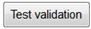
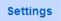
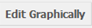

.. note::
	
   The following sub-section assumes that you now know how to navigate to a specific survey on the relevant list or to a specific question in that survey. If you are not sure how to do this, please refer to the section *Navigating within PyQuestionnaire*, located at the bottom-half of the chapter :doc:`Access PyQuestionnaire<access_Questionnaire>`. 
   
   It is also assumed that you know how to add a survey page to a new survey you are developing. More details regarding this, can be found in the sub-section :doc:`Importing, adding, exporting and deleting a survey page <import_add_export_delete_page>`.
   
   
.. |add| image:: ../_static/user/add.png
.. |editSource| image:: ../_static/user/editSource.png
.. |edit| image:: ../_static/user/editButton.png
.. |delete| image:: ../_static/user/deleteButton.png
.. |export| image:: ../_static/user/exportButton.png
.. |Settings| image:: ../_static/user/settingsButton.png
.. |Layout| image:: ../_static/user/layoutButton.png
.. |editGraphically| image:: ../_static/user/editGraphicallyButton.png
.. |results| image:: ../_static/user/resultsButton.png
.. |update| image:: ../_static/user/updateButton.png
.. |dontUpdate| image:: ../_static/user/dontUpdateButton.png
.. |updated| image:: ../_static/user/updatedButton.png
.. |surveyButton| image:: ../_static/user/surveyButton.png
.. |preview| image:: ../_static/user/previewButton.png

.. |plusButton| image:: ../_static/user/plusButton.png
.. |minusButton| image:: ../_static/user/minusButton.png
.. |previewButton| image:: ../_static/user/previewButton.png

.. _topSurveyPageSection:
   
Editing an existing survey page
-------------------------------

This sub-section explains how to edit an existing survey. This can be done in two ways:

1. Edit the survey graphically - go to relevant sub-subsection by clicking :ref:`here <graphicEditSub-subsection>`. 

   You could also navigate to the specific paragraphs of this sub-subsection: scroll down to check the instructions and relevant information on how to edit a page's layout or :ref:`here <settingsParagraph>` to learn what is included in the option *"Settings"* and how to change these.

2. Edit the source of the survey - go to relevant sub-subsection by clicking :ref:`here <sourceEditSub-subsection>`. 

.. _graphicEditSub-subsection:

Edit graphically 
^^^^^^^^^^^^^^^^
There are two options (i.e. sets of steps) to edit a survey page graphically, depending on where in the system you are:
 
 **Option 1** if you are in the survey page you have just added or imported. Click on the relevant link from the navigation menu on the left hand-side of this screen.
 
 **or** 
 
 **Option 2** if you are in the survey's **home page** (:doc:`ref<conceptsAndTerms>`) and not on the survey page you want to edit. Click on the relevant link from the navigation menu on the left hand-side of this screen.

.. _layoutParagraph: 
Edit a page's layout
""""""""""""""""""""
  
.. _stepOne:: 

**Option 1**  
$$$$$$$$$$$

Let's assume that you have just created a new survey and have added a new page, as shown in the sub-section :doc:`Importing, adding, exporting and deleting a survey page <import_add_export_delete_page>`. By default, following the creation of a new survey page, you would be directed to the graphically **Edit** screen shown below:
  
.. image:: ../_static/user/pageEditScreen.png   
   :align: center

Notice that on the screenshot shown above, the |Layout| button is dark blue, whereas the |Settings| button is light blue. This indicates that, by default, you are on the **Layout** screen. If you click on the |Settings| button, you will be directed to the **Settings** screen, as demonstrated below, and the background colours of the mentioned buttons will reverse, i.e. |Layout| button now has a light blue background etc:
   
  .. image:: ../_static/user/settingsScreen.png
     :align: center

  **1.1)** When you are directed to the **Layout** screen, the following message appears:
      
	   .. image:: ../_static/user/dragElementsMessage.png
	      :align: center
				  
  **1.2)** The elements the message refers to, are included in a list on the right-hand side of your screen, entitled *Core Questions*. The list has four sections, specifically: *Text*, *Choice*, *Hidden* and *Other*, as illustrated in the example below:
   
	   .. image:: ../_static/user/elementsList.png
	      :align: center
  
  **1.3)** To access any of the above four sections of elements, all you need to do is to click on the arrow next to each section's title, as illustrated below:

       .. image:: ../_static/user/clickElementsList.png
	      :align: center
  
  **1.4)** As you can see, the lists above include the following types of elements, distinguished in three categories:
            
		1.4.1) **Informative**
		     
			   * **Text**: this element allows the presentation of useful information to the participants about the survey, a survey page or a particular question. Pictures or screenshots can also be added in a *Text* box.
		
		1.4.2) **Input**
		
			  * **Single-line text input**: where the participants can type a single-line response in free text.
			   
			   ------------------------------------------------------------------------------------------
			   
			  * **Multi-line text input**: where the participants can type more than one lines in free text.
			   
			   ------------------------------------------------------------------------------------------
			   
			  * **Number input**: where participants can type a number, within a minimum and maximum value defined by you.
			   
			   ------------------------------------------------------------------------------------------
			   
			  * **E-mail input**: where participants can type their e-mail address.
			   
			   ------------------------------------------------------------------------------------------
			   
			  * **URL input**: where participants are allowed to type a URL, starting with *https://*.
			   
			   ------------------------------------------------------------------------------------------
			   
			  * **Date input**: where participants are allowed to type a date in the usual date format, i.e. "dd/mm/yyyy".
			   
			   ------------------------------------------------------------------------------------------
			   
			  * **Time input**: where participants are allowed to type a date in the usual time format, i.e. "hh:mm".
			   
			   ------------------------------------------------------------------------------------------
			   
			  * **Date & time input**: where participants are allowed to type a date and time using the above formats, i.e. "dd/mm/yyyy hh:mm".
			   
			   ------------------------------------------------------------------------------------------
			   
			  * **Month input**: where participants are allowed to type a valid month by either inputting a number from 1 to 12 or by typing the name of a valid month. The two options ensure that no incorrect data are entered should a participant enters an invalid month (either by typing the name or entering a number other than the valid ones) or spell a valid month incorrectly. 
			   
			   ------------------------------------------------------------------------------------------
			  
			  * **Single choice grid**: where the participants can choose, rather than type as in the elements mentioned above, only one value on the question's Likert scales. Each single choice grid can have one or more subquestions displayed on a grid, along with the corresponding Likert scales, as the name of this element clearly suggests.
			  
			  ------------------------------------------------------------------------------------------
			  
			  * **Single choice**: similar to the *Single choice grid* with its only difference being that this element does have sub-questions.
			  
			  ------------------------------------------------------------------------------------------
			  
			  * **Multiple choice grid**: similar to the *Single choice grid* mentioned above, with the difference that the participants can choose more than one values from the question's Likert scales.
			  
			  ------------------------------------------------------------------------------------------
			  
			  * **Multiple choice**: similar to the *Multiple choice grid* with its only difference being that this element does have sub-questions.
			  
			  ------------------------------------------------------------------------------------------
			  
			  * **Country selection**: where the participant can choose their country of origin, country of residence etc.
			  
			  ------------------------------------------------------------------------------------------
			  
			  * **Language selection**: where the participant can choose the language they speak, they study in etc.

		1.4.3) **Other**
		        
			   * **Hidden value**:
			   * **Page timer**: which counts how much time a participant spends on a survey page.
			   * **Automatic next page**: which automatically leads the participant to another survey page after a time period, that you have previously determined, has passed.
			   * **JavaScript check**: which will prompt the survey to check whatever conditions you have added in the **JavaScript** box of the **Settings** screen. The functionality of the box is explained in more detail in paragraph (2.4) below.
			   * **Confirmation checkbox**: as the name suggests, this is simply a checkbox that the participant will have to check so that they are able to progress with answering a survey. An example of using this element is when you need to ensure that the participant has understood the terms of the survey and provided their consent to you recording and using their replies.
			   * **Ranking**: this allows you to rank a list of items by moving items up or down the list, through dragging and dropping them. An example of this is provided below:
			    
			               .. image:: ../_static/user/rankingExample.png
						           :align: center
			
  **1.5)** Now that you have an idea of the different elements mentioned above, go through the elements' list to identify the element you believe is appropriate for your purposes. 
  
  **1.6)** Drag and drop the element you need to the left, on the main contents part of the screen, below the *"Drag elements from the right..."* message. When you do this, before you drop the element, you will notice a rectangular with dotted lines appearing below the above mentioned message. This shows you where in the survey page the element will be dropped, a helpful functionality when re-arranging or adding elements to the list of elements you have already added on a survey page. An example of this is shown in the screenshot below: 
  
        .. image:: ../_static/user/dragElementScreen.png
                :align: center
  
  **1.7)** If you have made a mistake and would like to remove an element from the survey page, click on the big **x** button on the right hand-side of the blue bar of the element, indicated in the provided screenshot below by red arrows and circles:
  
        .. image:: ../_static/user/deleteElements.png
                :align: center
  
  --------------------------------------------------------------------------------------------------------------------------------------
  
	.. note:: Remember to click on the **Update** button after any change or addition you make, when you are in the **Edit** mode. More instructions regarding this are given in paragraph 1.12 further below.
  
  --------------------------------------------------------------------------------------------------------------------------------------
  
  **1.8)** Depending on the element you choose, you will either need to double-click within the edit area of the element (an example of this is the element *Text*) or start typing the information required in the relevant fields (all other elements on the list use this approach).
  
  To help you understand what we mean by this, some screenshots are provided below, illustrating the different editing options that exist for different types of elements:
  
	  1.8.1) **The option relating to the Text element**:
	   
	    1. As mentioned above, the *Text* element has different editing options than the rest of the elements available. The screenshot below show how an added *Text* element would look like on your survey page:
			   
		   .. image:: ../_static/user/textElement.png
			        :align: center
					 
		  ---------------------------------------------------------------------------------------------------------------------------
					 
	    2. To edit this element, either double-click where prompted to do so or click on the pencil button, indicated in the above screenshot by a red arrow and circle.
		  
		  ---------------------------------------------------------------------------------------------------------------------------
		  
	    3. This will take you to the relevant edit screen, which offers options similar to those provided by any off-the-shelf Word editor. A screenshot showing the mentioned edit screen is provided below:
		
		   .. image:: ../_static/user/editTextScreen.png
				    :align: center
		
		 ---------------------------------------------------------------------------------------------------------------------------
		
	    4. By hovering with your mouse cursor above each element of the editing bar in the screenshot provided above, a tooltip will appear informing of the functionality of that element.
		   
	  1.8.2) **The options relating to all other elements**:
	  
	   1. Field **Name**: This corresponds to the variable or the group of variables that a survey question examines. The label of each variable will be used in a statistical software for data analysis. This option is common to all elements, except from *Text*.
		  
	   ---------------------------------------------------------------------------------------------------------------------------
		  
	   2. Field **Title**: This is the text that will appear on your survey. This option is common to all elements, except from *Text*, *Page Timer*, *Automatic Next Page* and *Hidden Value*.An example, of single choice grid question that illustrates how the text in the field *Title* appears on a preview of a survey under development, is provided below:
		 
		  .. image:: ../_static/user/titleExample.png
	               :align: center
		 
	   ---------------------------------------------------------------------------------------------------------------------------
		  
	   3. Field **Help**: In this field you can add some advice on how to complete the question, perhaps some information regarding the purpose of the question and so on. In effect, any information that will help the participant to understand how to reply to a survey question. This option is common to all elements, except from *Text*, *Automatic Next Page*, *Page Timer*,*Hidden Value* and JavaScript Check.
		   
	   ---------------------------------------------------------------------------------------------------------------------------
		  
	   4. Checkbox **Required**: As you will notice under the checkbox, there is the phrase *"This question must be answered"*. Ticking this checkbox, therefore, will ensure that the participant does not move away from a survey page without answering the compulsory questions. This option is common to all elements, except from *Text*, *Page Timer*, *Automatic Next Page* and *Hidden Value*.
		   
	   ---------------------------------------------------------------------------------------------------------------------------
		   
	   5. Fields **Minimum value** and **Maximum value**: This option is only available for the *Number input* element. As is clear from the option's title, the only values that a participant is permitted to type in the relevant fields are those that are not less than the minimum value and larger than the maximum value.
		  
	   ---------------------------------------------------------------------------------------------------------------------------
		  
	   6. Fields **Before label** and **After label**: Especially useful in Likert scales, these options allow you to type words that represent the two extremes of a Likert scale. For example, for the Likert scale **not satisfied/very satisfied**, the value in the *Before label* field would be the phrase *not satisfied*, whereas the value in the *After label* field would be the phrase *very satisfied*. The Likert scale would then appear in the survey as shown in the example screenshot below:
	   
	      .. image:: ../_static/user/likertScale.png
	               :align: center
	  
	   ---------------------------------------------------------------------------------------------------------------------------
		 
	   7. List **Answers** or **Items**:
		   
		7.1. Field **Value**: This option can be part of the list **Answers**/**Items** or a field on its own. Both this option and *Label* explained below, are only applicable to elements **Single Choice**, **Single Choice Grid**, **Multiple Choice** and **Multiple Choice Grid**. The option **Value** corresponds to the code used for statistical analysis. Each *value* represents only one response selected by a participant from a list of possible responses available to a question. An example of this option is provided below: 
		
		     .. image:: ../_static/user/valuesExample.png
		              :align: center
	         
		7.2. Field **Label**: This option can be part of the list **Answers**/**Items** or a field on its own. This option relates to the field **Value** explained above. Each *label* corresponds to a possible response that a participant can give when answering a question. All labels put together represent the exact set of possible responses to be selected by participant. The above screenshot demonstrates this.
		  
	   ---------------------------------------------------------------------------------------------------------------------------
		  
	   8. List **Sub-questions**:
	    
	    The list appears only when using the elements **Single Choice Grid** and **Multiple Choice Grid**. You can add or remove a sub-question (consisting of a *Name* and a *Label*), by using the **buttons** |plusButton| or |minusButton|. 
	   
	    This option is particularly useful for those survey questions that use Likert scales and examine a set of variables, rather than just one. The screenshot below demonstrates such a case, with the question at hand examining a set of variables corresponding to the interface used in a search system setup for an experiment. This set of variables consists of 8 variables, namely *thumbnail, title, description, creator, type, subject, relation and country*: 
	   
	        .. image:: ../_static/user/subQuestions.png
				     :align: center
					 
		8.1. Field **Name**: As with the field **Value** (7.1 above), any word entered in the field **Name** corresponds to the code used for statistical analysis. Each field value represents only one response selected by a participant from a list of possible responses available to a question.
		     
		8.2. Field **Label**: The functionality of this option has already been described in (7.2) above. Note, however, that this option can only be found under the list **Sub-questions** and not as a field on its own.
		   
	   ---------------------------------------------------------------------------------------------------------------------------
		   
	   9. Drop-down menu **Display as**: The following options are only available for *Multiple Choice* and *Single Choice*.
	   
		9.1. Menu option **Horizontal table**: The option allows you to display a question's possible answers as a horizontal table. An example is provided below:
		
		     .. image:: ../_static/user/horizontalTable.png
		              :align: center

		9.2. Menu option **Vertical list**: The option allows you to display a question's possible answers as a vertical list. An example is provided below:
		
		     .. image:: ../_static/user/verticalList.png
		              :align: center
		
		9.3. Menu option **Select box**: The option allows you to display a question's possible answers as options in a drop-down menu. An example is provided below:
		
			 .. image:: ../_static/user/selectBox.png 
				      :align: center
		
	   ---------------------------------------------------------------------------------------------------------------------------
		 
	   10. Drop-down menu **Allow other answers**: As the menu title suggests, this option is used to specify whether other answers are permitted beyond the ones you have specified when developing your survey. The sub-options of this menu are either *Yes* or *No*. This option is common to all elements, except from *Text*, *Automatic Next Page*, *Hidden Value* and JavaScript Check.
		 
	  ---------------------------------------------------------------------------------------------------------------------------
		 
	   11. Field **Prioritise these countries**: The option enables you to specify which countries you want appearing first on the list of countries that the system contains. This option only applies to the elements *Country Selection* and *Language Selection*.
	   
	     An example of this option is provided below:
	   
		   .. image:: ../_static/user/priorityCountries.png
					:align: center
	   
	  ---------------------------------------------------------------------------------------------------------------------------
		
	   12. Field **Timeout (Seconds)**: This field allows you to specify how many seconds you want passing before the survey automatically moves the participant to the next survey page. You do this by typing the required number in the relevant field. This option only applies to the element *Automatic Next Page*.
 
  **1.9)** When you have finished editing a page, you can click on the |previewButton| button, located in the grey ribbon above the title of the survey page edited, or what we have previously called **Manipulation buttons** (:doc:`ref<survey_home_page_elements>`), as shown in the screenshot below:
  
			.. image:: ../_static/user/previewButtonScreen.png
					:align: center

  By clicking on the |previewButton| button, the **Preview** screen will appear, allowing you to see how the element or elements, you have just added on the page, would look in a live survey. An example is provided below - **note** how the set of **Manipulation buttons** (:doc:`ref<survey_home_page_elements>`) on the grey ribbon have now changed to include the buttons **Edit, Data, Delete** and **Export**:
  
            .. image:: ../_static/user/previewButtonScreenTwo.png
					:align: center
  
  Use the scroll bar on the right of the system's preview screen, **not** your browser's bar, to scroll up and down the survey page. If you want to go back to **Edit** mode, simply click on the |edit| button.
  
  **1.10)** To test whether an element on the survey page is working properly, scroll down the **Preview** screen, populating the available fields with possible responses and then click on the |testValidationButton| button at the bottom of that screen. If all your answers follow the rules set by you in the previous stages described above, then you will get the following message:
  
			 .. image:: ../_static/user/positiveValidationMessage.png
				     :align: center
  
  Otherwise, an error message will come up, such as the one below, demonstrating to you that incorrect answers will not be accepted by the system:
  
			 .. image:: ../_static/user/negativeValidationMessage.png
			         :align: center
					 
  The error message will also indicate to you which section of your survey page is incorrect or where on it answers are missing, by putting this within a rectangle with red borders. Depending on the error, different prompt messages will appear, as the screenshot below demonstrates:
  
  .. image:: ../_static/user/negativeValidationMessageTwo.png  
             :align: center

  **1.11)** Finally, when you have finished adding, editing and previewing elements on a survey page and decided that you want to keep the changes you have made, remember to click on the |update| button.
  
  This is part of the white ribbon that follows you around when you are in **Edit** mode and is enclosed in a rectangle with black dotted borders. Two screenshots illustrating how this ribbon looks like in different parts of the **Edit** mode, are provided below:
  
	    .. image:: ../_static/user/updateButtonScreen.png
                   :align: center

.. _stepTwo::

**Option 2** 
$$$$$$$$$$$

If you are on the survey's **home page** (:doc:`ref<conceptsAndTerms>`) and not on the survey page you want to edit, then click on the |edit| button, part of the **Manipulation buttons** (:doc:`ref<survey_home_page_elements>`) and located under the title and listed characteristics of that page. 

You will then be directed to the **Edit** screen, an example of which is provided further above. Now simply follow the steps described in **Option 1** above to edit a survey page graphically.
				   
:ref:`back to the top <topSurveyPageSection>`
   
.. _settingsParagraph:

Edit the settings of a page
"""""""""""""""""""""""""""
**2.1)** Let's now assume that you have completed the graphical editing of your survey page. You can now click on the |Settings| tab, located below the survey page's title, as demonstrated in the screenshot below:

          .. image:: ../_static/user/settingsButtonExample.png
				  :align: center
		 
**2.2)** This will take you to the **Settings** screen:

		  .. image:: ../_static/user/settingsScreen.png
		          :align: center
				  
		  .. hint:: You know that you are on the **Settings** screen because the background colour of the |Settings| tab has changed from light blue to dark blue.

**2.3)** On this screen, you can change the *Name* and the *Title* of the survey page according to your experiment's needs.
	
**Note** that the field *Name* refers to the name of the specific survey page you are viewing at any given time, whereas the field *Title* refers to the actual question that appears on that page when your survey is live. 
   
The page's title will be used to refer to the relevant question, when you export a survey's results. For a more detailed explanation of the **Results** functionality, refer to sub-subsection **Downloading data** of the sub-section :doc:`Downloading, uploading and clearing data and datasets <get_data>`.

.. Note:: The **Name** field of the **Settings** screen can be used to categorise all the variables included on a survey page, if you do decide that you want to create a data dictionary for your survey. For example, in the above screenshot that comes from an actual survey, the **Name** of the survey page is *experience*. In this example, *experience* is the name of a set of variables including *visit*, *visit reason*, *familiar* etc., examined by the main question of the survey page shown in the **Title** field, that is *Your experiences with culture and heritage*.
   
**2.4)** On the **Settings** screen, you can also:

		1. Choose the type of questions added on a survey page, for example whether they would be *single* or a *repeated* questions. *Single* means that questions can only be answered once, whereas *Repeated* means that they can be answered repeatedly by a participant. 
		
		   .. image:: ../_static/user/typeSurveyPage.png
			       :align: center
		   
		   To choose the type of question that will go on your survey page, click on the downward arrow of the drop-down menu under the field title **Type**.
		   
		2. Add data items by typing a number in the relevant field. Here you specify how many data items should be selected from the "Data Set" that you attached to the page. The questions will be repeated for each selected data item. This makes it possible to have the same question(s) answered for different data items. 
		   
		   .. image:: ../_static/user/dataItems.png
				   :align: center
		
		   As already mentioned above, this field is connected to the *Data Set*, the functionality of which is explained in the sub-subsection **Downloading data** of the sub-section :doc:`Downloading, uploading and clearing data and datasets <get_data>`
		
		3. Add a *Control Item* to the question by typing the number of *Data Items* you require for your survey in the relevant field. A definition of the *Control Item* is provided :doc:`here <conceptsAndTerms>`.
		
		   .. image:: ../_static/user/dataItems.png
				   :align: center
				   
		4. Choose whether you would like the question numbers to be shown, by using the drop-down menu of the field *Show Question Numbers*. 
		
		   .. image:: ../_static/user/showQuestionNumbers.png
				   :align: center
		
		5. Choose which survey page should be the next from the one you are currently viewing, by using the drop-down menu of the field *Transition*.
		
			.. image:: ../_static/user/transition.png
				    :align: center
		
		   Note that the default value in the *Transition* field is the end of the survey. You can choose the default value, as I did in the screenshot right above, by clicking on the drop-down menu's arrow. 
		   
		   You can also add a condition by clicking on the relevant button, next to the default value. This will allow you to determine which page the survey should lead your participant to, should they give a specific answer. 
		   
		   An example screenshot is provided below: 
		   
		    .. image:: ../_static/user/addCondition.png
		            :align: center
					
		   The screenshot above illustrates the sequence of steps taken to add a condition to a survey page. Here, I first clicked on the button **AddCondition** and then selected a variable, included in that particular survey page, by its *Name*. The field *Name* is included in the **Layout** tab and is explained in paragraph "Edit a page's layout", sub-paragraph 1.8.2/7.1 further above. 
		   
		   I then made that equal to 1, by typing the number in the relevant field, where 1 is included in the list of values I have previously specified for this variable, under the field *Value* of the **Layout** tab. Details for this field are in paragraph "Edit a page's layout", sub-paragraph 1.8.2/7.1 further above. 
		   
		   Essentially, the condition illustrated in the above screenshot means that should the participant choose the question reply that corresponds to value "1", they will then be led to page "Some things about you..." (shown in step (4) of the screenshot above) rather than the default page "Task" (shown in step (1) of the screenshot).
		   
		   Finally, to delete the condition you have just added, click on the **DeleteCondition** button, next to the **AddCondition** button.
			
		6. Add your own CSS Styles by clicking on the link *CSS styles* below the *Transition to* menu and typing in the box that appears. Clicking on the link again will make the text box disappear, but keep the text you have just added.
		
		7. Add your own code in JavaScript by clicking on the link *Javascript* below the link *CSS styles* and typing in the box that appears. As with *CSS Styles*, clicking on the *Javascript* link again will make the text box disappear, but keep the text you have just added. This box allows you to further customise your survey according to your experiment's needs.

**2.5)** Following any changes you carried out on a survey page, make sure that you click on the |update| button at the bottom of your  screen.

**2.6)** It is also a good idea to validate these in order to make sure that everything will work fine when the survey is actually running. To do this, click on the |preview| button located above the survey page's title.
	
**2.7)** By doing this, you will be directed to the **Preview** screen of that page, where you will be presented with an example of how the page will look like in the live survey.
	
**2.8)** On the **Preview** screen, you can test questions by providing combinations of replies (checking boxes, typing free text etc.) in order to ensure that responses that do not follow the conditions you set for a specific question, are not permitted. 
  
**2.9)** When you are done completing a preview question, click on the |testValidation| button, which you can find by scrolling to the bottom of the **Preview** screen. 

**2.10)** If you have completed the preview question appropriately, the following message will appear below the title of the survey page:
  
           .. image:: ../_static/user/correctValidation.png 
                   :align: center
  
  Otherwise, you will get an error message like the one below:
	   
	       .. image:: ../_static/user/wrongValidation.png 
                   :align: center 
			
  Each part of the survey page that has an error, will be indicated to you within a rectangle with red borders and an appropriate message, as demonstrated in the screenshot below:
	   
	       .. image:: ../_static/user/failValidationMessage.png
		           :align: center
		
**2.11)** Once you have finished testing a survey page, in order to navigate away from it and back to the **home page** (:doc:`ref<conceptsAndTerms>`) screen, click on the |surveyButton| tab, one of the **Navigation tabs** (:doc:`ref<survey_home_page_elements>`), located above the survey page's title. 

Otherwise, you can click on the |edit| button of the **Manipulation buttons** (:doc:`ref<survey_home_page_elements>`) above, to continue editing it, the |delete| button if you have decided that you want to start all over again or the |export| button to download the survey page in XML code.
   
:ref:`back to the top <topSurveyPageSection>`
 
.. _sourceEditSub-subsection:

Edit source
^^^^^^^^^^^
The way to access this option depends on whether you are on the survey's **home page** (:doc:`ref<conceptsAndTerms>`) or the actual survey page you want to edit. 

a. If you are on the survey's **home page** (:doc:`ref<conceptsAndTerms>`), follow the instructions provided in **paragraph 2** of the :ref:`Edit graphically<graphicEditSection>` sub-subsection above.
	
b. If you are on the actual survey page you want to edit, that is on the **Edit** screen of the page (see screenshot in :ref:`Edit graphically<graphicEditSub-subsection>` sub-subsection), click on the |editSource| button, above the title of the survey page:

 **b.1)** You will now be directed to the **Edit Source** screen, as demonstrated below.
 
 This screen is the same as the **Settings** screen mentioned in paragraph :ref:`Edit the settings of a page<settingsParagraph>` above, except from the textbox *Content* that the **Settings** screen does not have. The first screenshot corresponds to the top part of the screen. Notice that some.
	
          .. image:: ../_static/user/editSourceScreenOne.png 
                  :align: center
	
 The screenshot below corresponds to the bottom part of the **Edit Source** screen.
	
          .. image:: ../_static/user/editSourceScreenTwo.png 
                  :align: center  
		  
  **b.2)** To revert to the screen used in the sub-subsection :ref:`Edit graphically <graphicEditSub-subsection>`, simply click on the |editGraphically| button above the survey page's title.
   
  **b.3)** The top part of the **Edit Source** screen, is the same as the **Settings** screen described above in the sub-subsection :ref:`Edit graphically <graphicEditSub-subsection>`, except from the **Content** box.
  
  
:ref:`back to the top <topSurveyPageSection>`