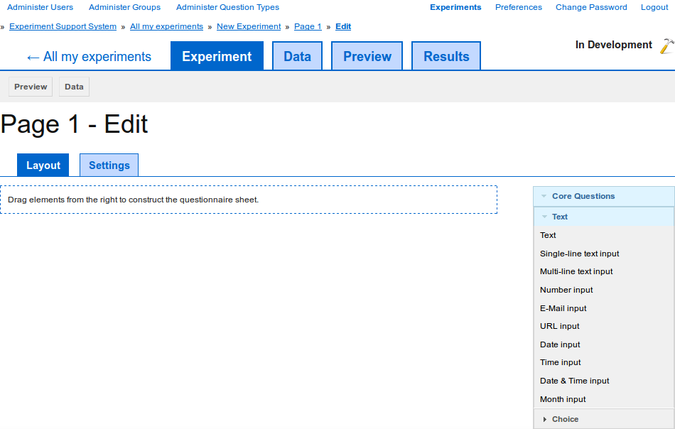
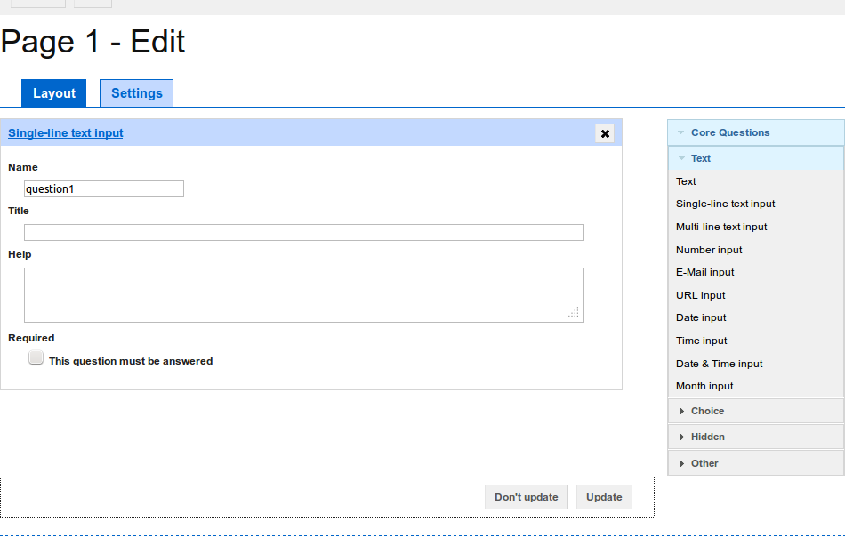
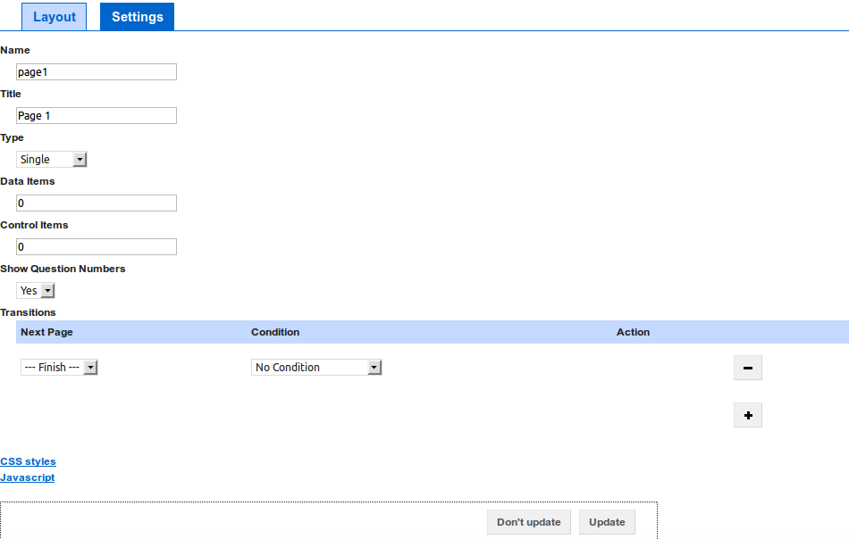

Editing a page
--------------

When you start editing a new :term:`page`, it initially has no
:term:`questions` and the editing interface looks looks similar to
`figure 1 <#fig-edit-page-1>`_.

.. _fig-edit-page-1:

   
   **Figure 1**: The area on the left of the editing interface contains all the
   :term:`questions` on this :term:`page`. You can drag :term:`questions` from
   the list of available :term:`questions` on the right into your :term:`page`.

Adding questions
^^^^^^^^^^^^^^^^

To add :term:`questions` to your :term:`page`, simply drag them from the gray
box on the right into the main :term:`question` area on the left. After
dragging a :term:`question` into the :term:`page`, the interface will look
similar to `figure 2 <#fig-edit-page-2>`_. For a detailed list of
:term:`questions` that are always available, check the
:doc:`default_questions`.

.. _fig-edit-page-2:

   **Figure 2**: After adding a :term:`question` to the :term:`page`, the :term:`question`'s
   attributes can be edited.

After adding a :term:`question` to a :term:`page` or if the :term:`page`
already had one or more :term:`questions`, then the :term:`questions`'
attributes can be edited. To save any changes you have made, click on the
"Update" button at the bottom of the page. Clicking on the "Don't update"
button will take you back to the :term:`page`'s preview.

Previewing the page
^^^^^^^^^^^^^^^^^^^

To see what the :term:`page` looks like after adding, removing, or changing
:term:`questions`, click on the "Preview" button in the toolbar. This will
show a preview of how the :term:`page` will look to the :term:`experiment`'s
:term:`participants` (see :doc:`preview_page`).

Editing the page's settings
^^^^^^^^^^^^^^^^^^^^^^^^^^^

In addition to editing a :term:`page`'s questions, you can also change a
number of settings that are available for each :term:`page` (see
`figure 3 <#fig-edit-page-3>`_).

.. _fig-edit-page-3:

   **Figure 3**: Click on the "Settings" tab to change a page's settings.

To edit the :term:`page`'s settings, click on the "Settings" tab above the
list of :term:`questions`. In the "Settings" tab you can configure the
following settings:

**Name**
  The unique name of the :term:`page`.
**Title**
  The :term:`page`'s title, which is shown to :term:`participants` when they
  view the :term:`page`.
**Type**
  The Experiment Support System supports :term:`pages` that each
  :term:`participant` can answer once and :term:`pages` on which they can
  answer the questions repeatedly. This setting determines which of these two
  types the :term:`page` is. Use this setting to specify which of the two
  modes you want for this :term:`page`.
**Data Items**
  The number of :term:`data items` to show to each :term:`participant`. This
  only has an effect if the :term:`page` is linked to a :term:`data set`.
  See :doc:`edit_data` for details.
**Control Items**
  The number of :term:`control items` to show to each :term:`participant`. This
  only has an effect if the :term:`page` is linked to a :term:`data set`.
  See :doc:`edit_data` for details.
**Show Question Numbers**
  Use this setting to specify whether :term:`questions` should automatically
  be numbered, when they are shown to the :term:`participants`.
**Transitions**
  Using the transitions you specify which :term:`pages` to transition to,
  after the :term:`participant` has answered all :term:`questions` on this
  :term:`page`. You can specify multiple transitions. The first transition
  for which the conditions hold will be used. Use the "+" button to add
  further transitions and the "-" next to a transition to delete that
  transition.
    
  The following three types of transitions are supported:
  
  **Unconditional**
    This will always transition to the specified :term:`page`.
  **Participant answer**
    If the answer the participant provided to a question equals the given
    value, then transition to the specified :term:`page`.
  **Permutation**
    If there are more items in the :term:`permutation set` to work through for
    the user, then transition to the specified :term:`page`.
  
**CSS Styles**
  Clicking on the "CSS Styles" link shows a text area where you can specify
  additional CSS rules that are added to the :term:`page` when it is shown to
  the :term:`participants`.
**Javascript**
  Clicking on the "Javascript" link shows a text area where you can specify
  extra JavaScript code that is run when the :term:`page` is displayed to the
  :term:`participants`.
