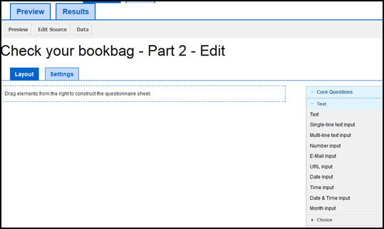

.. note::
	
   The following sub-section assumes that you now know how to navigate to a specific survey on the relevant list or to a specific question in that survey. If you are not sure how to do this, please refer to the section *Navigating within PyQuestionnaire*, located at the bottom-half of the chapter :doc:`Access PyQuestionnaire<access_Questionnaire>`. 
   
   It is also assumed that you know how to add a survey page to a new survey you are developing. More details regarding this, can be found in the sub-section :doc:`Importing, adding, exporting and deleting a survey page <import_add_export_delete_page>`.
   
   
.. |add| image:: ../_static/user/add.png
.. |editSource| image:: ../_static/user/editSource.png
.. |edit| image:: ../_static/user/editButton.png
.. |Settings| image:: ../_static/user/settingsButton.png
.. |Layout| image:: ../_static/user/layoutButton.png
.. |editGraphically| image:: ../_static/user/editGraphicallyButton.png
.. |results| image:: ../_static/user/resultsButton.png
.. |update| image:: ../_static/user/updateButton.png
.. |dontUpdate| image:: ../_static/user/dontUpdateButton.png
.. |updated| image:: ../_static/user/updatedButton.png
.. |surveyButton| image:: ../_static/user/surveyButton.png
.. |preview| image:: ../_static/user/previewButton.png
.. |testValidation| image:: ../_static/user/testValidation.png

.. _topSection:
   
Editing an existing survey page
-------------------------------

This sub-section explains how to edit an existing survey. This can be done in two ways:

1. Edit the survey graphically - go to relevant sub-subsection by clicking :ref:`here <graphicEditSub-subsection>`.

2. Edit the source of the survey - go to relevant sub-subsection by clicking :ref:`here <sourceEditSub-subsection>`. 

.. _graphicEditSub-subsection:

Edit graphically 
^^^^^^^^^^^^^^^^
There are two sets of steps to edit a survey page graphically, depending on where in the system you are:

1. Let's assume that you have just created a new survey and have added a new page, as shown in the sub-section :doc:`Importing, adding, exporting and deleting a survey page <import_add_export_delete_page>`. By default, following the creation of a new survey page, you would be directed to the graphically **Edit** screen shown below:
  

Notice that on the screenshot shown above, the |Layout| button is dark blue, whereas the |Settings| button is light blue. This indicates that, by default, you are on the **Layout** screen. If you click on the |Settings| button, you will be directed to the **Settings** screen, as demonstrated below, and the background colours of the mentioned buttons will reverse, i.e. |Layout| button now has a light blue background etc:
   
  .. image:: ../_static/user/settingsScreen.png
     :align: center

  **1.1)** When you are directed to the **Layout** screen, the following message appears:
      
	   .. image:: ../_static/user/dragElementsMessage.png
	      :align: center
				  
  **1.2)** The elements the message refers to, are included in a list on the right-hand side of your screen, entitled *Core Questions*. The list has four sections, specifically: *Text*, *Choice*, *Hidden* and *Other*, as illustrated in the example below:
   
	   .. image:: ../_static/user/elementsList.png
	      :align: center
  
  **1.3)** To access any of the above four sections of elements, all you need to do is to click on the arrow next to each section's title, as illustrated below:

       .. image:: ../_static/user/clickElementsList.png
	      :align: center
  
  **1.4)** As you can see, the lists above include the following types of elements, distinguished in three categories:
            
		1.4.1) **Informative**
		     
			   * **Text**: this element allows the presentation of useful information to the participants about the survey, a survey page or a particular question.
		
		1.4.2) **Input**
		
			   * **Single-line text input**: where the participants can type a single-line response in free text.
			   * **Multi-line text input**: where the participants can type more than one lines in free text.
			   * **Number input**: where participants can type a number, within a minimum and maximum value defined by you.
			   * **E-mail input**: where participants can type their e-mail address.
			   * **URL input**: where participants are allowed to type a URL, starting with *https://*.
			   * **Date input**: where participants are allowed to type a date in the usual date format, i.e. "dd/mm/yyyy".
			   * **Time input**: where participants are allowed to type a date in the usual time format, i.e. "hh:mm".
			   * **Date & time input**: where participants are allowed to type a date and time using the above formats, i.e. "dd/mm/yyyy hh:mm".
			   * **Month input**: where participants are allowed to type a valid month by either inputting a number from 1 to 12 or by typing the name of a valid month. The two options ensure that no incorrect data are entered should a participant enters an invalid month (either by typing the name or entering a number other than the valid ones) or spell a valid month incorrectly. 
			   * **Single choice grid**: where the participants can choose, rather than type as in the elements mentioned above, only one value on the question's likert scales. Each single choice grid can have one or more subquestions displayed on a grid, along with the corresponding likert scales, as the name of this element clearly suggests.
			   * **Single choice**: similar to the *Single choice grid* with its only difference being that this element does have sub-questions.
			   * **Multiple choice grid**: similar to the *Single choice grid* mentioned above, with the difference that the participants can choose more than one values from the question's likert scales.
			   * **Multiple choice**: similar to the *Multiple choice grid* with its only difference being that this element does have sub-questions.
			   * **Country selection**: where the participant can choose their country of origin, country of residence etc.
			   * **Language selection**: where the participant can choose the language they speak, they study in etc.

		1.4.3) **Other**
		        
			   * **Hidden value**:
			   * **Page timer**: which counts how much time a participant spends on a survey page.
			   * **Automatic next page**: which automatically leads the participant to another survey page after a time period, that you have previously determined, has passed.
			   * **JavaScript check**:
			   * **Confirmation checkbox**: as the name suggests, this is simply a checkbox that the participant will have to check so that they are able to progress with answering a survey. An example of using this element is when you need to ensure that the participant has understood the terms of the survey and provided their consent to you recording and using their replies.
			   * **Ranking**:
			
  **1.5)** Now that you have an idea of the different elements mentioned above, go through the elements' list to identify the element you believe is appropriate for your purposes. 
  
  **1.6)** Drag and drop the element you need to the left, on the main contents part of the screen, below the *"Drag elements from the right..."* message. When you do this, before you drop the element, you will notice a rectangular with dotted lines appearing below the above mentioned message. This shows you where in the survey page the element will be dropped, a helpful functionality when re-arranging or adding elements to the list of elements you have already added on a survey page. An example of this is shown in the screenshot below: 
  
        .. image:: ../_static/user/dragElementScreen.png
                :align: center
  
  **1.7)** If you have made a mistake and would like to remove an element from the survey page, click on the big **x** button on the right hand-side of the blue bar of the element, indicated in the provided screenshot below by red arrows and circles:
  
        .. image:: ../_static/user/deleteElements.png
                :align: center
  
  **1.8)** Depending on the element you choose, you will either need to double-click within the edit area of the element (an example of this is the element *Text*) or start typing the information required in the relevant fields (all other elements on the list use this approach). To help you understand what we mean by this, some screenshots are provided below, illustrating the different editing options that exist for different types of elements:
  
       1.8.1) **The option relating to the Text element**:
	   
			1.8.1.a) As mentioned above, the *Text* element has different editing options than the rest of the elements available. The screenshot below show how an added *Text* element would look like on your survey page:
			
			.. image:: ../_static/user/textElement.png
					:align: center
        
			1.8.1.b) To edit this element, either double-click where prompted to do so or click on the pencil button, indicated in the above screenshot by a red arrow and circle.
			
			1.8.1.c) This will take you to the relevant edit screen, which offers options similar to those provided by any off-the-shelf Word editor. A screenshot showing the mentioned edit screen is provided below:
		
			.. image:: ../_static/user/editTextScreen.png
		
			1.8.1.d) By hovering with your mouse cursor above each element of the editing bar in the screenshot provided above, a tooltip will appear informing of the functionality of that element.
		   
	   1.8.2) **The options relating to all other elements**:
 
  **1.9)** Remember to click on the update button when finished adding and editing elements on a survey page.
  
  **1.8)** Now click on the |Settings| button to be directed to the **Settings** screen, mentioned above.
   
  **1.9)** On this screen, you can change the *Name* and the *Title* of the survey page according to your experiment's needs. Note that the field *Name* refers to the name of the element, that is the specific survey page you are viewing at any given time, whereas the field *Title* refers to the actual question that appears on that page. An example of this is provided with the screenshot below, with the relevant fields enclosed in rectangular with dotted borders:
   
           .. image:: ../_static/user/nameTitleExample.png 
                   :align: center  
   
      The element's name will be used to refer to the relevant question, when you export a survey's results, as shown in the sub-subsection **Downloading data** of the sub-section :doc:`Downloading, uploading and clearing data <get_data>`. For example, using the above screenshot, if you clicked on the |results| button, you would get the following screen:
   
           .. image:: ../_static/user/ nameTitleExampleResults.png 
                   :align: center  
   
      For a more detailed explanation of the **Results** screen, refer to sub-subsection **Downloading data** of the sub-section :doc:`Downloading, uploading and clearing data <get_data>`.
   
  **1.9)** On the **Settings** screen, you can also:
   
	       - Choose the type of question asked, for example whether it would be a *single* or a *repeated* question.
	       - Add data items.
	       - Make the question a *Control Item* (see :doc:`here <conceptsAndTerms>` for a definition of this).			
	       - Choose whether you would like the question numbers to be shown, by using the drop-down menu of the field *Show Question Numbers*.			
	       - Which survey page should be the next from the one you are currently viewing, by using the drop-down menu of the field *Transition to*.			
	       - Add your own CSS Styles by clicking on the link *CSS styles* below the *Transition to* menu and typing in the box that appears. Clicking on the link again will make the text box disappear, but keep the text you have just added.			
	       - Add your own code in JavaScript by clicking on the link *Javascript* below the link *CSS styles* and typing in the box that appears. As with *CSS Styles*, clicking on the *Javascript* link again will make the text box disappear, but keep the text you have just added.

  **1.10)** Following any changes you carried out on a survey page, it is a good idea to validate these in order to make sure that everything will work fine when the survey is actually running. To do this, click on the |preview| button located above the survey page's title.
	
  **1.11)** By doing this, you will be directed to the **Preview** screen of that page, where you will be presented with an example of how the page will look like in the live survey.
	
  **1.12)** On the **Validation** screen, you can test questions by providing combinations of replies (checking boxes, typing free text etc.) in order to ensure that responses that do not follow the conditions you set for a specific question, are not permitted. 
  
  If, for example, you specify that a question must be answered, then clicking on the "Test Validation" button enables you to check that this is actually being applied. Similarly, if you select a date or time or number question and then try to answer the question with an invalid value, then the "Test Validation" button will show what happens if you provide an incorrect answer.
	
  **1.13)** When you are done completing a preview question, click on the |testValidation| button as indicated in the example screenshot below:
	       .. image:: ../_static/user/testValidationScreen.png 
                   :align: center

  **1.14)** If you have completed the preview question appropriately, the following message will appear below the title of the survey page:
  
           .. image:: ../_static/user/successValidation.png 
                   :align: center
  
       Otherwise, you will get an error message like the one below:
	   
	       .. image:: ../_static/user/failValidation.png 
                   :align: center 
		
  **1.15)** Once you have finished testing a survey page, in order to navigate away from it and back to the **home page** (:doc:`ref<conceptsAndTerms>`) screen, click on the |surveyButton| tab, one of the **Navigation tabs** (:doc:`ref<survey_home_page_elements>`), located above the survey page's title.
 

:ref:`back to the top <topSection>`
   
------------------------------------------------------------------------------------------------------------------------------------------------------------------------

2. If you are on the survey's **home page** (:doc:`ref<conceptsAndTerms>`) and not on the survey page you want to edit, then click on the |edit| button, located under the title and listed characteristics of that page. You will then be directed to the **Edit** screen, an example of which is provided further above. Now simply follow the steps described in **paragraph 1** above to edit a survey page graphically.

   
:ref:`back to the top <topSection>`

.. _sourceEditSub-subsection:

Edit source
^^^^^^^^^^^
The way to access this option depends on whether you are on the survey's **home page** (:doc:`ref<conceptsAndTerms>`) or the actual survey page you want to edit. 

1. If you are on the survey's **home page** (:doc:`ref<conceptsAndTerms>`), follow the instructions provided in **paragraph 2** of the :ref:`Edit graphically<graphicEditSection>` sub-subsection above.
	
2. If you are on the actual survey page you want to edit, that is on the **Edit** screen of the page (see screenshot in :ref:`Edit graphically<graphicEditSub-subsection>` sub-subsection), click on the |editSource| button, above the title of the survey page:

 **2.1)** You will now be directed to the **Edit Source** screen, as demonstrated below. This screen is the same as the **Settings** screen mentioned in the :ref:`Edit graphically<graphicEditSub-subsection>` sub-subsection above, except from the textbox *Content* that the **Settings** screen does not have. The first screenshot corresponds to the top part of the screen. Notice that some.
	
          .. image:: ../_static/user/editSourceScreenOne.png 
                  :align: center
	
  The screenshot below corresponds to the bottom part of the **Edit Source** screen.
	
          .. image:: ../_static/user/editSourceScreenTwo.png 
                  :align: center  
		  
  **2.2)** To revert to the screen used in the sub-subsection :ref:`Edit graphically <graphicEditSub-subsection>`, simply click on the |editGraphically| button above the survey page's title.
   
  **2.3)** The top part of the **Edit Source** screen, is the same as the **Settings** screen described in **sub-paragraph 1.4** of the sub-subsection :ref:`Edit graphically <graphicEditSub-subsection>`, except from the **Content** box.
  
  
:ref:`back to the top <topSection>`