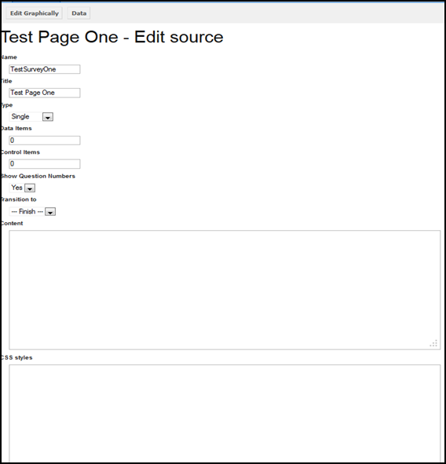
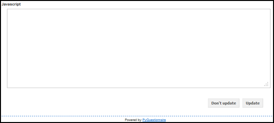

Editing an existing survey page
-------------------------------
You can edit the survey page in two ways:

1. **Edit graphically**, which is the above screen where you are directed by default, upon clicking the |add| button.
  
2. **Edit source**, which is the screen shown further below in two parts. To access this option, you will need to click on |editSrc| button of default edit screen mentioned further above.
  
Edit graphically 
================

Edit source
===========

    
