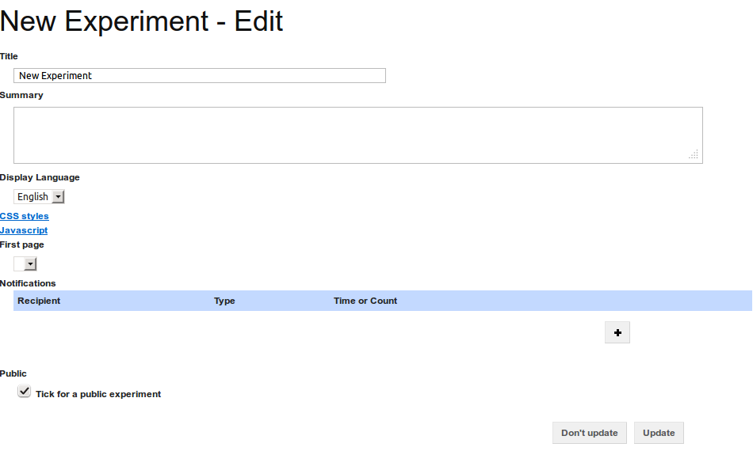

Editing the experiment's settings
---------------------------------

To edit the :term:`experiment`'s settings, click on the "Edit" button in
the :term:`experiment` overview page's toolbar
(see :doc:`edit_experiment`, figure 1). This takes you to the experiment
settings page (`figure 1 <#fig-experiment-settings>`_).

.. _fig-experiment-settings:

   **Figure 1**: The experiment settings page showing all available settings

The experiment settings page allows you to update the following settings:

**Title**
  The title is used to identify the experiment and shown on the main landing
  page
  
**Description**
  If the experiment is publicly available, then this description is shown
  to prospective participants so that they have an idea of what they experiment
  is about
  
**Display Language**
  The language that is used in the experiment participants' interface.
  Currently only English is supported.

**CSS Styles**
  Click on this setting to show an input box via which you can specify
  additional Cascading Stylesheet rules that are used to style the experiment
  that is shown to the :term:`participant`. The rules specified in this box
  are applied to all :term:`pages`.

**JavaScript**
  Click on this setting to show an input box via which you can specify
  additional JavaScript code that is run on each :term:`page`, when the
  :term:`participants` see the :term:`experiment`.

**First page**
  Using this drop-down selection, specify which of the :term:`pages` is to be
  used as the first :term:`page` that is shown to the :term:`participants`.

**Notifications**
  The Experiment Support System can automatically generate notifications when
  certain milestones are reached in the experiment. To add a notification,
  click on the "+" button. You can then specify the e-mail address that the
  notification is sent to, the event (either at specific intervals or when a
  minimum number of :term:`participants` have participated) that causes the
  notification to be sent, and the time interval or number of
  :term:`participants` for the event.
  
  You can specify multiple notifications. To delete a notification, click on
  the "-" button next to the notification you wish to delete.
  
**Public**
  Tick the checkbox to have your experiment show up on the main landing page
  when you run it.

To save any changes you have made, click on the "Update" button. To discard the
changes and go back to the experiment overview page, click on the "Don't
update" button.
