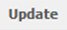
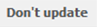

.. note::
	
   The following section assumes that you now know how to navigate to a specific survey on the relevant list or to a specific question in that survey. If you are not sure how to do this, please refer to the sub-section *Navigating within PyQuestionnaire*, located at the bottom-half of the section :doc:`Access PyQuestionnaire<access_Questionnaire>`.

Editing the survey
==================

.. manipulation button
.. |edit| image:: ../_static/user/editButton.png

This section explains how to edit the details of a survey you are developing, how to add your own CSS Styles and JavaScript code and how to change which of the survey pages will be the first to display.
  
How to edit a developed survey
------------------------------

	- If you are not already in the survey you want to edit, navigate to the **main profile screen** (:doc:`ref<conceptsAndTerms>`), as demonstrated in the *Access PyQuestionnaire* section earlier (:doc:`ref<access_Questionnaire>`).

	- If you are on the **main profile screen** (:doc:`ref<glossary>`), click on the |edit| button, next to the survey you want to edit.

	- This will take you to the **Edit** screen, shown below:

	.. image:: ../_static/user/editSurveyScreen.png
	   :align: center
   
	- On that screen, amend any field details according to your needs. 

	- By clicking on the links **CSS Styles** and **Javascript**, two boxes will appear, allowing you to type your own CSS Styles or JavaScript code respectively.

	- You can also change which of your survey pages will be the first page, by selecting one from the dropdown menu under the title **First page**.

	- When you are happy with the changes you made, click on the |update| button. Otherwise, click on the |dontUpdate| button. In any case, you will be re-directed to the **home page** (:doc:`ref<conceptsAndTerms>`)  of the survey you are developing.