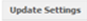
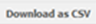
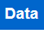
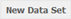
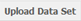
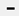
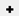
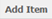

.. |results| image:: ../_static/user/resultsButton.png
.. |participantButton| image:: ../_static/user/exportParticipantButton.png
.. |questionButton| image:: ../_static/user/exportQuestionButton.png

.. |dataButton| image:: ../_static/user/dataButton.png
.. |download| image:: ../_static/user/download.png
.. |upload| image:: ../_static/user/upload.png
.. |clear| image:: ../_static/user/clear.png
.. |browse| image:: ../_static/user/browseButton.png
.. |uploadButton| image:: ../_static/user/uploadButton.png
.. |dontUploadButton| image:: ../_static/user/dontUploadButton.png 
.. |addDataButton| image:: ../_static/user/addDataButton.png
.. |editButton| image:: ../_static/user/editButton.png
.. |deleteButton| image:: ../_static/user/deleteButton.png
.. |updateButton| image:: ../_static/user/updateButton.png
.. |updateButton| image:: ../_static/user/updateButton.png
.. |dontUpdateButton| image:: ../_static/user/dontUpdateButton.png 
.. |add| image:: ../_static/user/add.png
.. |dontAdd| image:: ../_static/user/dontAdd.png 

.. |create| image:: ../_static/user/createButton.png

.. |detach| image:: ../_static/user/detachButton.png
.. |dataButton| image:: ../_static/user/dataButton.png 

.. note::

   The following sub-section assumes that you now know how to navigate to a specific survey on the relevant list or to a specific question in that survey. If you are not sure how to do this, please refer to the section *Navigating within PyQuestionnaire*, located at the bottom-half of the chapter :doc:`Access PyQuestionnaire<access_Questionnaire>`.

.. _topDataSection:
   
Downloading, creating, uploading and clearing data and datasets 
---------------------------------------------------------------
In this sub-section you will learn how to work with data gathered from your experiments. As the title suggests, there are four data-relevant functions that the survey system has:

1. Download data - go specifically to downloading data relating to :ref:`the results of a survey<downloadSurveyData>` **or** the :ref:`sample data uploaded to a survey<downloadPageData>` for testing purposes.
 
2. Upload data to a survey and attach it to a survey page - go to the :ref:`relevant sub-subsection <uploadData>`

3. Editing or deleting the data sets from a survey - go to the :ref:`relevant sub-subsection <editData>`
  
4. Editing and deleting the data items (:doc:`ref<conceptsAndTerms>`) of a data set or detaching a data set attached to a survey page. This part contains instructions for editing and deleting the data items (:doc:`ref<conceptsAndTerms>`) of a data set **or** detaching a data set attached to a survey page - go to the :ref:`relevant sub-subsection <clearData>`

.. _downloadData:

Downloading data and data sets
^^^^^^^^^^^^^^^^^^^^^^^^^^^^^^

.. _downloadSurveyData:

**Results data from a survey**
""""""""""""""""""""""""""""""
*(these are data relating to the results of a survey that has finished or is still running)*

  a) First, navigate to the **home page** (:doc:`ref<conceptsAndTerms>`) of the required survey, if you are not already there.
  
  b) Click on the |results| tab, included in the **Navigation tabs** (:doc:`ref<survey_home_page_elements>`) of the survey's **home page** (:doc:`ref<conceptsAndTerms>`) screen. An example screenshot of this is shown below, where the above button is highlighted:
	
  .. image:: ../_static/user/resultsHighlighted.png
   :align: center
		
  c) Clicking on the above mentioned button will take you to the **Results** screen, an example of which is demonstrated below: 
	
  .. image:: ../_static/user/resultsScreen.png
   :align: center
	
  d) You will then have the choice to export results by participant, by clicking on the |participantButton| button, or by question, by clicking on the |questionButton| button. As the screenshot above indicates, both buttons are located on the grey strip above the survey's title.
  
    d1.1) **If you choose to export results by participant**, then the following screen will appear: 
   
	   - The screenshot below shows the top half of that screen,
	   
	   .. image:: ../_static/user/exportParticipantTop.png
		:align: center

	   whereas, the next screenshot shows the bottom half of that screen.
		
	   .. image:: ../_static/user/exportParticipantBottom.png
		:align: center
		
	   - Note that a list, entitled **Export Settings** is the main part of the above mentioned screen.
	   
	   - As the one-line instructions advise, below the list's title, you can select which questions to export and, where applicable, what data attribute to use to identify the original data-item. 
	   
	   - You can do this by ticking/unticking the boxes that appear next to the title of each question on the provided list.
	   
	   - You can also define the value that will appear in your data set when a field has not been answered.
	   
	   - Do this by scrolling down and finding the field *Non-answered value*. This is located at the end of the list of questions appearing on your screen. 
	   
	   - Type an appropriate message in the above mentioned field.
	   
	   - When you decide which questions you want to include in your data file and what the **Non-answered** message will be, click on |updateSettings| button, located on the right of your screen, just below the field *Non-answered value*.
	   
	   - By clicking that button, the webpage will refresh and a sample of how your extracted will look like, will be provided under the title *Sample Data* at the bottom of the screen.
	   
	   - When you are happy with the sample data shown, scroll up and find the |downloadCSV| button.
	   
	   - Upon clicking that button, a prompt message will appear asking you to save the relevant .csv file on your computer.
	   
	   - To navigate back to your **Results** screen, click on the |results| button at the top of the screen.
	  
    d1.2) **If you choose to export results by question**, you will be directed to the screen below:
   
	   .. image:: ../_static/user/exportQuestion.png
	      :align: center

	   - One of the settings you can change on this screen, is the value that will appear in your data set when a field has not been answered. 
	   
	   - As with the option to **Export by Participant**, discussed above, you can do this by typing an appropriate message in the field *Non-answered value*, located below the title **Export Settings** at the top of the screen.
	   
	   - When you are done with the above, click on the |updateSettings| button, located on the right of your screen, just below the field *Non-answered value*.
	   
	   - By clicking that button, the webpage will refresh and a sample of how your extracted will look like, will be provided under the title *Sample Data* at the bottom of the screen.
	   
	   - In addition to the above, you can tick in the box under the title **SPSS Safe Columns**, which will change the column titles of your data to a format recognisable by SPSS.
	   
	   - As mentioned above, remember to click on the |updateSettings| button for this change to be applied to your survey.
	   
	    .. Important:: 
	   
		   The *Sample Data* is only an excerpt of the available data. Use the "Download as CSV" button to export all results.
	   
	   - When you are happy with the sample data shown, scroll up and find the |downloadCSV| button.
	   
	   - Upon clicking that button, a prompt message will appear asking you to save the relevant .csv file on your computer.
	   
	   - To navigate back to your **Results** screen, click on the |results| tab at the top of the screen.

:ref:`back to the top <topDataSection>`
	
.. _downloadPageData:
	
**Sample data from a survey**
"""""""""""""""""""""""""""""

This functionality is different to downloading results data from a survey that is either finished or is still running, as you are not actually downloading data gathered through participants completing your survey. 

Rather, the data you are downloading are sample data that you might have previously uploaded to the survey, when the latter was in development. Uploading data is explained better further below, in the :ref:`relevant sub-subsection <uploadData>`.

So, to download the sample data that are attached to a survey:

  a) Navigate to the **home page** (:doc:`ref<conceptsAndTerms>`) of the appropriate survey and find the required survey page from the survey's list of survey pages.
  
  b) Click on the **Data** tab as shown in the screenshot below:
  
	.. image:: ../_static/user/dataTab.png
	        :align: center

  c) This will then take you to the **Data Sets** screen, shown below, where a list of the data sets you have uploaded to the survey will be displayed:
  
    .. image:: ../_static/user/dataSets.png
	        :align: center 
  
  d) To extract the required data, simply click on the |download| button, indicated in the screenshot above.
  
  e) Upon clicking that button, a prompt message will appear asking you to save the relevant .csv file on your computer. Carry out the appropriate action to download the file.
  
  f) To navigate back to your **Results** screen, click on the |results| tab, above the title **Data Sets**.
  
:ref:`back to the top <topDataSection>`

.. _uploadData:

Uploading and attaching data
^^^^^^^^^^^^^^^^^^^^^^^^^^^^

You would upload data to a survey and then attach these to specific survey pages, if you want to test the survey you are developing and see how it works when data are added.
 
  a) To upload data, navigate to the appropriate survey's home page.
  
  b) Click on the **Data** tab as shown in the screenshot below:
  
	.. image:: ../_static/user/dataTab.png
	        :align: center

  c) This will then take you to the **Data Sets** screen, shown below, where a list of the data sets you have uploaded to the survey will be displayed:
  
    .. image:: ../_static/user/dataSets.png
	        :align: center 

  d) On that screen, you can either upload a new data set or creating a data set manually:
  
Upload a new data set
"""""""""""""""""""""
   
   d.1.1) To upload a new data set, click on the |uploadDataSet| button, located in the grey strip above the title **Data Sets**.
   
   d.1.2) This will then take you to the **Upload Data Set** screen, as shown below, where you can select the CSV file that contains the data you wish to upload:
  
	    .. image:: ../_static/user/uploadDataScreen.png
	            :align: center
		
   d.1.3) Click on the |browse| button on that screen and navigate to the .csv file that you want to upload
  
   d.1.4) Then click on the |uploadButton| button located on the right of your screen, to upload the .csv file choosen, or the |dontUploadButton| button, if you decide that you do not want to proceed with the upload.
  
   d.1.5) By clicking the |uploadButton| button, the next screen you will see is the **Data Sets** screen, mentioned above in step (c).
  
Create a new data set manually
""""""""""""""""""""""""""""""
	
   d.2.1) To create a new data set, click on the |newDataSet| button, located in the grey strip above the title **Data Sets**.
   
   d.2.2) This will lead you to the **New Data Set** screen, provided below:
   
        .. image:: ../_static/user/newDataSetScreen.png
		        :align: center
				
   d.2.3) On that screen you can add the name of the data set, by typing this in the box under the title **Name**, and the titles of the attributes that the data set will have, by typing in the boxes below **Item attributes**. Note that the attribute titles will actually correspond to the titles of the columns that the data set will have.
   
   d.2.4) You can add more attributes by clicking on the |plus| button or remove attributes by clicking on the |minus| button. Both these buttons are located to the right of the attribute title. 
   
   d.2.5) When you are done adding or removing attributes, click on the |create| button at the bottom right hand-side of the screen.
   
   d.2.6) By doing so, the title of the **New Data Set** screen will change to **Edit Data Set** and the buttons |dontUpdate| and |update| will appear. You can use these buttons after you have removed or added attributes at a later stage. An example of this is given below:
   
        .. image:: ../_static/user/editDataSet.png
				:align: center							
   
   d.2.7) When you are done with the new data set you have just added, click on any of the tabs above the title **Edit Data Set** to go to the **Results**, **Survey**, **Data** or **Preview** screens.
   
  e) Whether you have uploaded or created a data set manually, you will then be able to edit it. Details of this functionality are given in the sub-subsection :ref:`Editing the uploaded data <editData>` below.
  
  f) Following the above steps, you can attach a data set to a survey page of your choice.
  
  g) To do this, find the required survey page from the survey's list of pages and click on the |dataButton| button, located within the box of the relevant page, as illustrated in the screenshot below:
	   
	 .. image:: ../_static/user/dataScreen.png
			 :align: center
  
  h) This will take you to the **Data** screen for that page:
  
	 - If there are no data attached to that page, you will get the screen provided below. In this case, you will need to follow the instructions for :ref:`uploading data to a survey<uploadData>`:
  
	 .. image:: ../_static/user/noData.png
			 :align: center
	 
	 -------------------------------------------------------------
	 
	 - If there are data attached to that page, you will get the following screen, providing you with the name of the file of sample data attached, the different columns in that file and the sample data contained in the file:
	 
	 .. image:: ../_static/user/Data.png
			 :align: center
			 
  i) Click on the **Attach Data** button, as demonstrated in the screenshot below:
   
   .. image:: ../_static/user/attachData.png
		   :align: center
   
  k) This will lead you to the **Attach Data Set to Page** screen, where by clicking on the arrow of the drop-down menu, next to the title **Data Set to attach**, you can choose an uploaded data set to attach to that page. Then click on the **Attach** button to actually attach the data set to the page:
  
   .. image:: ../_static/user/attachDataSet.png
		   :align: center
		   
  l) Upon clicking the **Attach** button, you will be directed to the data set itself. There, you can:

   1. Edit the data set
   2. Edit one or more data items of that data set
   3. Delete one or more data items
   4. Detach the data set from the page
	
These functionalities are explained in more detail in the sections below.

:ref:`back to the top <topDataSection>`

.. _editData:

Editing or deleting the data sets from a survey
^^^^^^^^^^^^^^^^^^^^^^^^^^^^^^^^^^^^^^^^^^^^^^^

  a) To *edit* or *delete* any of the data sets uploaded to a survey, navigate to the **Data Sets** screen by clicking on the **Data** tab, as shown at step (b) of the :ref:`Uploading data <uploadData>` sub-subsection above.
  
  b) On the **Data Sets** screen, find the data set you want to work with from the list of data sets provided (if you have previously uploaded more than one). 
  
  c) Then click on the |editButton| button to edit that data set or the |deleteButton| button to delete that data set. Both buttons are located to the right of the title of the data set you need, under the title **Action**.
  
   c.1) If you clicked on the |editButton| button, the **Edit Data Set** screen should have appeared where, as mentioned already further above, you can add or remove attributes (see **step d.2.6** of the **Create a new data set manually** part right above). An example screenshot of this screen is provided below:
   
      .. image:: ../_static/user/editDataSet.png
			  :align: center
  
   c.2) If you clicked on the |deleteButton| button, the **Delete Data Set** screen should have appeared. On this screen, click on the |deleteButton| button to delete that data set. Following the deletion of the data set, you will be taken back to the **Data Sets** screen. 
   
   An example screenshot of the **Delete Data Set** screen is given below:
   
      .. image:: ../_static/user/deleteDataSet.png
	          :align: center

:ref:`back to the top <topDataSection>`

.. _clearData:

Editing and deleting the data items of a data set or detaching a data set attached to a survey page
^^^^^^^^^^^^^^^^^^^^^^^^^^^^^^^^^^^^^^^^^^^^^^^^^^^^^^^^^^^^^^^^^^^^^^^^^^^^^^^^^^^^^^^^^^^^^^^^^^^

Last, but not least, is the option to edit the data items (:doc:`ref<conceptsAndTerms>`) of a data set or detach a data set attached to a survey page.

  a) To do any of the above, navigate to the survey page that has a data set attached to it. 
  
  b) Click on the |dataButton| button, as demonstrated in the screenshot below:
  
   .. image:: ../_static/user/dataScreen.png
	       :align: center
		   
  c) This will take you to the data set attached to that page.

Editing and deleting the data items of a data set
"""""""""""""""""""""""""""""""""""""""""""""""""
  
  d) On the appearing screen, scroll to the right of the above screen by using the scroll bar as indicated in the screenshot below:
  
     .. image:: ../_static/user/scrollRight.png
	    :align: center

  e) By doing this, you will find the |editButton| and |deleteButton| buttons as indicated in the screenshot below:
  
   .. image:: ../_static/user/editDeleteScreen.png
	       :align: center
  
   **e.1)** Clicking on the |editButton| button will allow you to edit the values of the data item (:doc:`ref<conceptsAndTerms>`) you have just chosen. 
   
         e.1.1) To edit those values, simply click in the boxes below the title of each attribute and type what you require. The above is done through the **Edit Data** screen, an example of which is given below:
		 
		        .. image:: ../_static/user/editDataItem.png
	                    :align: center
    
		e.1.2) When you are done editing, scroll to the bottom of the screen and either click on the |updateButton| button or the |dontUpdateButton| button. Whichever you click on, you will be directed back to the **Data** screen.
   
		e.1.3) You can also add a new data item (:doc:`ref<conceptsAndTerms>`) on a data set, by clicking on the |addItemButton| button, that has now appeared next  buttons **Edit**, **Delete** and **Download**.
   
		e.1.4) By clicking on that button, you will be provided with the option to manually add data to your survey. An example of the screen you are directed to is the one below:
		
		      .. image:: ../_static/user/addDataScreenTwo.png
	                  :align: center
  
		e.1.5) After you type the required values in each of the fields corresponding to the questions included in the survey, scroll down the screen and either click on the |add| button or the |dontAdd| button. 
   
		e.1.6) Whichever you click on, you will be directed back to the **Data** screen. The only difference will be that if you added a record manually, this will appear at the end of the list of records in the **Data** screen.

   **e.2)** If you click on the |deleteButton| button, you will be asked to confirm that you want to delete a given record. Click **OK** and the record will be deleted.

Detaching a data set attached to a survey page
""""""""""""""""""""""""""""""""""""""""""""""
To detach a data set from a survey page is quite simple.

a) Navigate to the required survey page as shown further above.

b) Click on the |dataButton| button of that survey page and you will be directed to the data set attached to that survey page.

c) As shown in the screenshot below, next to the **Edit Data** button, there is a **Detach Data** button:

  .. image:: ../_static/user/detachData.png
          :align: center

d) Click on that button and you will be taken to a screen similar to the one below:

  .. image:: ../_static/user/detachDataScreen.png
          :align: center

e) On that screen, click on the |detach| button to detach the data set attached to the survey page.

f) Following the above, you will be led back to the survey's **home page** (:doc:`ref<conceptsAndTerms>`).
	  
:ref:`back to the top <topDataSection>`