.. |results| image:: ../_static/user/resultsButton.png
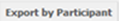
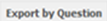
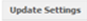
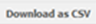
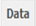
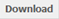
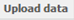
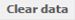
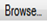
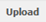
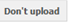
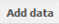
.. |editButton| image:: ../_static/user/editButton.png
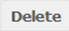
.. |updateButton| image:: ../_static/user/updateButton.png
.. |updateButton| image:: ../_static/user/updateButton.png
.. |dontUpdateButton| image:: ../_static/user/dontUpdateButton.png 
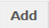
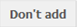

.. note::

   The following section assumes that you now know how to navigate to a specific survey on the relevant list or to a specific question in that survey. If you are not sure how to do this, please refer to the section :doc:`nav_Qnnaire`.
  
Downloading, uploading and clearing data
========================================
In this section you will learn how to work with data gathered from your experiments. As the title suggests, there are four data-relevant functions that the survey system has:

1. Download data - go to the :ref:`relevant section <downloadData>`
 
2. Upload data to a survey question - go to the :ref:`relevant section <uploadData>`

3. Editing the uploaded data, with particular attention to the option of manually adding experiment results gathered through a paper copy of the survey - go to the :ref:`relevant section <editData>`

4. Clear data attached to a survey question - go to the :ref:`relevant section <clearData>`

--------------------------------------------------------------------------------------------------------------------------------------------------------------------------------

.. _downloadData:

**Downloading data**

- **From a survey**

  a) First, navigate to the required survey, if you are not already there.
  
  b) Click on the |results| button, included in the *Navigation tabs* (:doc:`ref<survey_home_page_elements>`) of the survey's **home page** screen. An example screenshot of this is shown below, where the above button is highlighted:
  
  .. image:: ../_static/user/resultsHighlighted.png
   :align: center
	 
  c) Clicking on the above mentioned button will take you to the results screen, an example of which is demonstrated below: 
  
  .. image:: ../_static/user/resultsScreen.png
   :align: center

  d) You will then have the choice to export results by participant, by clicking on the |particButton| button, or by question, by clicking on the |questionButton| button.
  
    d1.1) **If you choose to export results by participant**, then the following screen will appear: 
   
	   - The screenshot below shows the top half of that screen,
	   
	   .. image:: ../_static/user/exportParticipantTop.png
		:align: center

	   whereas, the next screenshot shows the bottom half of that screen.
		
	   .. image:: ../_static/user/exportParticipantBottom.png
		:align: center
		
	   - Note that a list, entitled **Export Settings** is the main part of the above mentioned screen.
	   
	   - As the one-line instructions advise, below the list' title, you can select which questions to export and, where applicable, what data attribute to use to identify the original data-item. 
	   
	   - You can do this by ticking/unticking the boxes that appear next to the title of each question on the provided list.
	   
	   - You can also define the value that will appear in your data set when a field has not been answered.
	   
	   - Do this by scrolling down and finding the field **Non-answered value**. This is located at the end of the list of questions appearing on your screen. 
	   
	   - Type an appropriate message in the above mentioned field.
	   
	   - When you decide which questions you want to include in your data file and what the **Non-answered** message will be, click on |updateSettings| button, located on the right of your screen, just below the field **Non-answered value**.
	   
	   - By clicking that button, the webpage will refresh and a sample of how your extracted will look like, will be provided under the title **Sample Data** at the bottom of the screen.
	   
	   - When you are happy with the sample data shown, scroll up and find the |downCSV| button.
	   
	   - Upon clicking that button, a prompt message will appear asking you to save the relevant .csv file on your computer.
	   
	   - To navigate back to your **Results** screen, click on the |results| button at the top of the screen.
	  
    d1.2) **If you choose to export results by question**, you will be directed to the screen below:
   
	   .. image:: ../_static/user/exportQuestion.png
	      :align: center

	   - The only setting you can change on this screen is the value that will appear in your data set when a field has not been answered. 
	   
	   - As with the option to *Export by Participant*, discussed above, you can do this by typing an appropriate message in the field **Non-answered value**, located below the title **Export Settings** at the top of the screen.
	   
	   - When you are done with the above, click on |updateSettings| button, located on the right of your screen, just below the field **Non-answered value**.
	   
	   - By clicking that button, the webpage will refresh and a sample of how your extracted will look like, will be provided under the title **Sample Data** at the bottom of the screen.
	   
	    .. Important:: 
	   
		   The *Sample Data* is only an excerpt of the available data. Use the "Download as CSV" button to export all results.
	   
	   - When you are happy with the sample data shown, scroll up and find the |downCSV| button.
	   
	   - Upon clicking that button, a prompt message will appear asking you to save the relevant .csv file on your computer.
	   
	   - To navigate back to your **Results** screen, click on the |results| button at the top of the screen.
  
- **From a survey question**

  a) Navigate to the **home page** of the appropriate survey and find the required questions from the list provided. 
  
  b) Click on the |dataButton| button, located within the box of the relevant question, as illustrated in the screenshot below:
	   
	 .. image:: ../_static/user/dataScreen.png
	    :align: center
  
  c) This will take you to the **Data** screen for that question, of which an example screenshot is provided below:
  
	 .. image:: ../_static/user/data.png
	    :align: center
		
  d) To extract the required data, simply click on the |download| button located on the grey strip above the title of the survey.
  
  e) Upon clicking that button, a prompt message will appear asking you to save the relevant .csv file on your computer.
  
  f) To navigate back to your **Results** screen, click on the |results| button at the top of the screen.
  
.. Important:: *Downloading data from a survey question, works only after uploading data to it. The relevant process is explained in the sub-section below.*
  
-----------------------------------------------------------------------------------------------------------------------------------------------------------------------------------
    
.. _uploadData:

**Uploading data**

Data can only be uploaded to a specific survey question.

  a) To do this, navigate to the appropriate survey question as shown above, in the previous sub-section.
  
  b) Click on the |upload| button, located on the grey strip above the title of the survey.

  c) You will then be directed to **Upload Data** screen for that question, as shown below:
  
	 .. image:: ../_static/user/uploadDataScreen.png
	    :align: center
		
  d) Click on the |browse| button on that screen and navigate to the .csv file that you want to upload
  
  e) Then click on the |uploadButton| button located on the right of your screen, to upload the .csv file choosen, or the |dontUploadButton| button, if you decide that you do not want to proceed with the upload.
  
  f) By clicking the |uploadButton| button, the next screen you will see is the **Data** screen shown below:
  
	 .. image:: ../_static/user/addDataScreen.png
	    :align: center

  g) You will then be able to edit the uploaded data as shown in the relevant sub-section below.
--------------------------------------------------------------------------------------------------------------------------------------------------------------------------------

.. _editData:

**Editing the uploaded data**

  a) If you want to *edit* or *delete* any of the records uploaded, then scroll to the right of the above screen by using the scroll bar as indicated in the screenshot below:
  
     .. image:: ../_static/user/scrollRight.png
	    :align: center

  b) By doing this, you will find the |editButton| and |delButton| buttons as indicated in the screenshot below:
  
	 .. image:: ../_static/user/editDelScreen.png
	    :align: center
  
  c) Clicking on the |editButton| button will allow you to edit the answers of a given record, through the *Edit Data* screen, an example of which is given below:
  
  d) When you are done editing, scroll to the bottom of the screen and either click on the |updateButton| button or the |dontUpdateButton| button. Whichever you click on, you will be directed back to the **Data** screen.
  
  e) If you click on the |delButton| button, below the |editButton| button, you will be asked to confirm that you want to delete a given record. Click **OK** and the record will be deleted.
  
  f) You will have also noticed that a new button has now appeared next to the |uploadButton| button, above the uploaded records. This is the |addDataButton| button. This button is particularly useful should you need to enter experiment results gathered through a paper copy of the survey.
  
  g) By clicking on that button, you will be provided with the option to manually add data to your survey. An example of the screen you are directed to is the one below:
  
     .. image:: ../_static/user/addDataScreenTwo.png
	    :align: center
 
  i) After you type the required answers in each of the fields corresponding to the questions included in the survey, scroll down the screen and either click on the |add| button or the |dontAdd| button. 
  
  k) Whichever you click on, you will be directed back to the **Data** screen. The only difference will be that if you added a record manually, this will appear at the end of the list of records in the **Data** screen.
------------------------------------------------------------------------------------------------------------------------------------------------------------------------------------

.. _clearData:

**Clearing data**

Last, but not least, is the option to clear any data you have uploaded before. 

  a) To do this, navigate to the survey question where you uploaded your data.
  
  b) Click on the |dataButton| button to be directed to the question's page. 
  
  c) In the question's page, click on the |clear| button located on the grey strip above the title of the survey.
  
  d) A message will appear asking you to confirm deletion of data uploaded to that question.
  
  e) When you click **OK**, you will be taken back to the question's page, with the following message appearing within a dotted rectangle:
  
     .. image:: ../_static/user/noDataMessage.png
	    :align: center
  
  
