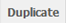
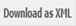
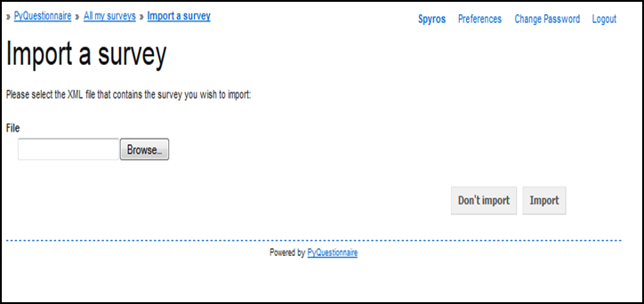
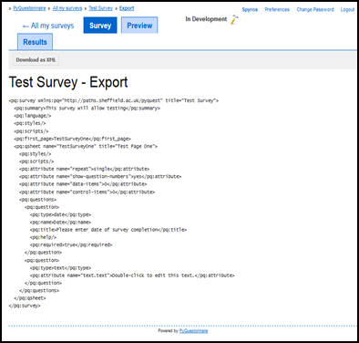

Importing, exporting, duplicating and deleting an existing survey
----------------------------
.. manipulation buttons
.. |export| image:: ../_static/user/exportButton.png

.. |delete| image:: ../_static/user/delButton.png

.. |browseButton| image:: ../_static/user/browseButton.png
.. |importButton| image:: ../_static/user/impButton.png
.. |dontImportButton| image:: ../_static/user/dontImpButton.png

.. note::
	
   The following section assumes that you now know how to navigate to a specific survey on the relevant list or to a specific question in that survey. If you are not sure how to do this, please refer to the section :doc:`nav_Qnnaire`.
   
   
This section explains how to import, export, duplicate or delete a survey.

Importing a survey
******************
The system allows you to write a survey in XML and upload it on your PyQuestionnaire profile, instead of using the system's GUI to develop it. You can import a survey by carrying out the following steps:

- If you are not already there, navigate to the main profile screen (:doc:`ref<glossary>`), as demonstrated in the *Access PyQuestionnaire* section earlier (:doc:`ref<access_Qnnaire>`).

- If you are on the main profile screen (:doc:`ref<glossary>`), click on the |impSurvey| button, located on the top left corner of the screen.

- This will take you to the *Import a Survey* screen, shown below:

- You then click on the |browseButton| button and navigate to the XML file you want to import in your profile.

- When you find and select the required file, click on the |importButton| button, if you decide that want to import it, or on the |dontImportButton| button, if you decide you want to discard it.

- The survey you have just imported will now appear in the list of surveys of your main profile screen. 

- You can then manipulate the imported survey in the same way that you do with surveys setup with the use of the PyQuestionnaire.

.. _expSurvey:
Exporting a survey
******************
You can export a survey by downloading its XML code in your files. To do this, you need to carry out the following steps:

- If you are not already in the required survey, navigate to your list of surveys in the main profile screen, as described further above.

- When you are in the survey you want to export, click on the |export| button, included in the *Manipulation buttons* (:doc:`ref<survey_home_page_elements>`) of that screen.

- The *Export* screen will appear as shown below:

 
- In that screen, click on the |downXML| button, for the relevant XML code to appear in your browser.

Duplicating a survey
********************
If you have a survey that is a good basis for further surveys to be developed on or if you want to test ideas you might have regarding the possible development paths you could follow without messing up the original survey, PyQuestionnaire allows you to duplicate it.

In order to action the above, follow the steps below:

.. _mainProfScreen:

If you are on the **main profile screen**
++++++++++++++++++++++

  a) click on the |duplicate| button, next to the survey you want to duplicate. 
  
  b) the *Duplicate* screen will appear, as illustrated below:

	.. image:: ../_static/user/duplScreen.png

  c) change the survey title in the field *Title* to avoid confusion with the original survey.
  
  d) click on the |duplicate| button again.
  
  e) you will then be directed to the **home page** of the duplicated survey.
  
  f) the duplicated survey will now appear in the list of surveys of your main profile screen.

If you are not already on the **main profile screen** but are in a different survey to the one you want to duplicate
++++++++++++++++

  a) navigate to the main profile screen (:doc:`ref<glossary>`), as demonstrated in the *Access PyQuestionnaire* section earlier (:doc:`ref<access_Qnnaire>`).
  
  b) follow the steps described above in the section :ref:`mainProfScreen`.

If you are in the survey that you want to duplicate
++++++++++++++++

  a) click on the |duplicate| button, included in the *Manipulation buttons* (:doc:`ref<survey_home_page_elements>`) of that screen.
  
  b) follow steps *b* to *f* of the section :ref:`mainProfScreen`.

Deleting a survey
*****************
To delete a survey, follow the steps below:

.. _delProfScreen:

If you are on the **main profile screen**
++++++++++++++++++++++

  a) click on the |delete| button, next to the survey you want to duplicate. 
  
  b) a message will appear asking you to confirm that you want to delete the selected survey, including its pages, data and results.

  c) click **OK** and that survey will disappear from your list. 

If you are not already on the **main profile screen** but are in a different survey to the one you want to duplicate
++++++++++++++++

  a) navigate to the main profile screen (:doc:`ref<glossary>`), as demonstrated in the *Access PyQuestionnaire* section earlier (:doc:`ref<access_Qnnaire>`).
  
  b) follow the steps described above in the section :ref:`delProfScreen`.

If you are in the survey that you want to duplicate
++++++++++++++++

  a) click on the |delete| button, included in the *Manipulation buttons* (:doc:`ref<survey_home_page_elements>`) of that screen.
  
  b) follow the steps described above in the section :ref:`delProfScreen`.