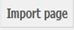
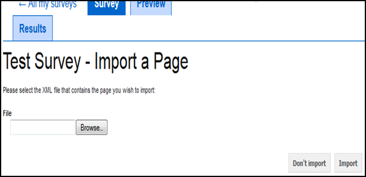

.. note::
	
   The following section assumes that you now know how to navigate to a specific survey on the relevant list or to a specific question in that survey. If you are not sure how to do this, please refer to the sub-section *Navigating within PyQuestionnaire*, located at the bottom-half of the section :doc:`Access PyQuestionnaire<access_Questionnaire>`.

Importing, exporting and deleting a survey page
--------------------
.. manipulation buttons

.. |importButton| image:: ../_static/user/importButton.png
.. |dontImportButton| image:: ../_static/user/dontImportButton.png
.. |browseButton| image:: ../_static/user/browseButton.png
.. |export| image:: ../_static/user/exportButton.png
.. |downloadXML| image:: ../_static/user/downloadXML.png
.. |delete| image:: ../_static/user/deleteButton.png
 
This section explains how to:

1. import a new page on a survey under development, by uploading an external XML file that you or your colleagues might have created. This allows the customisation of the survey pages according to your needs, without necessarily using the default options provided by our survey system. - go to relevant section by clicking :ref:`here<importPageSection>`. 

2. export a survey page - go to relevant section by clicking :ref:`here<exportPageSection>`. 

3. delete a survey page - go to relevant section by clicking :ref:`here<deletePageSection>`. 

.. _importPageSection:

Importing a page
******************
- While on the **home page** of your survey (:doc:`ref<conceptsAndTerms>`), click on the |importPage| button, included in the **Manipulation buttons** (:doc:`ref<survey_home_page_elements>`) of that screen.

- The following screen will then appear:

   
- On the appearing screen, click the |browseButton| button and navigate to the XML file you would like to add on your survey. 

- When you have completed the above step, click on the |importButton| button, if you decide that want to import the chosen file, or on the |dontImportButton| button, if you decide you want to discard it.

- By clicking on the |importButton| button, the imported page will appear under the list of pages that your survey already has. As a reminder, the list of pages, entitled **Pages**, is located at the survey's **home page** (:doc:`ref<conceptsAndTerms>`).
 
.. _exportPageSection:

Exporting a page
****************
Exporting a page works in a similar way to exporting a survey, as shown earlier in the *Importing, exporting, duplicating and deleting an existing survey* section (:doc:`ref<import_export_duplicate_delete_survey>`).

- If you are in the survey page you want to export

  a) Click on the |export| button above the survey title.
 
  b) You will then be directed to the **Export** screen, as shown below:

    .. image:: ../_static/user/exportPageScreen.png
       :align: center
	   
  c) To export the XML code of the page, click on the |downloadXML| button. The relevant XML code will then appear in your browser and you will be able to copy in one of your files.

-------------------------------------------------------------
  
- If you are in a survey page, but not the one you want to export
	
  a) Let's assume you are in page 2 of your survey, as shown below, but you want to export page 1 instead:

    .. image:: ../_static/user/pageTwoScreen.png
      :align: center  

  b) There are two ways to do this - see **Note** at the top of this section for guidance, if you do not remember how to do this.
  
  c) Whatever way you use, you will be directed to the survey's **home page** (:doc:`ref<conceptsAndTerms>`).
  
  d) You can then click on the link of the survey page you want to export.
  
  e) Finally follow the instructions (a) to (c) of the previous sub-section above.
       
.. _deletePageSection:
	
Deleting a page
*************** 
Deleting a page is pretty straightforward.

- If you are in the survey page you want to delete

  a) click on the |delete| button above the survey title.
  
  b) a message will appear asking you to confirm the deletion.
  
  c) if you are sure you want to delete the page, click **OK**. Otherwise, **Cancel** the request. 
  
  d) if you have clicked **OK**, you will be re-directed to the survey's **home page** (:doc:`ref<conceptsAndTerms>`).

  --------------------------------------------------------------------------------
  
- If you are in the survey's **home page** (:doc:`ref<conceptsAndTerms>`)

  a) You will be seeing a list of the available survey pages, under the title **Pages**, as shown below:
  
   **Note that** the details of each page (i.e. questions included, type of page and next page) and the available buttons are enclosed within a rectangle with dotted borders.
  
  b) Find the page you want to delete and click on the |delete| button of that page. 
  
  c) This will prompt a message asking to confirm the deletion.
  
  d) If you are sure you want to delete the page, click **OK**. Otherwise, **Cancel** the request. 
  
  e) As previously, if you have clicked **OK**, you will be re-directed to the survey's **home page** (:doc:`ref<conceptsAndTerms>`).
  