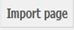
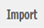
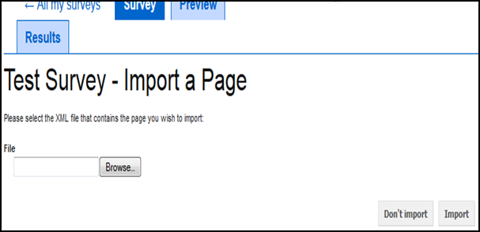

Importing a new survey page
--------------------
.. manipulation buttons

.. |browseButton| image:: ../_static/user/browseButton.png

This section explains how to import a new page on a survey under development, by uploading an external XML file that you or your colleagues might have created. This allows the customisation of the survey pages according to your needs, without necessarily using the default options provided by our survey system.

- While on the home page of your survey (:doc:`ref<glossary>`), click on the |importPage| button, included in the *Manipulation buttons* (:doc:`ref<survey_home_page_elements>`) of that screen.

.. Comment: the line >> :doc:`ref<glossary>` above, allows import_pg.rst to link to the glossary.rst

- The following screen will then appear:

   
- On the appearing screen, click the |browseButton| button and navigate to the XML file you would like to add on your survey. 

- When you have completed the above step, click on the |importButton| button, if you decide that want to import the chosen file, or on the |dontImportButton| button, if you decide you want to discard it.

- By clicking on the |importButton| button, the imported page will appear under the list of pages that your survey already has. As a reminder, the list of pages, entitled **Pages**, is located at the survey's **home page** (:doc:`ref<glossary>`).