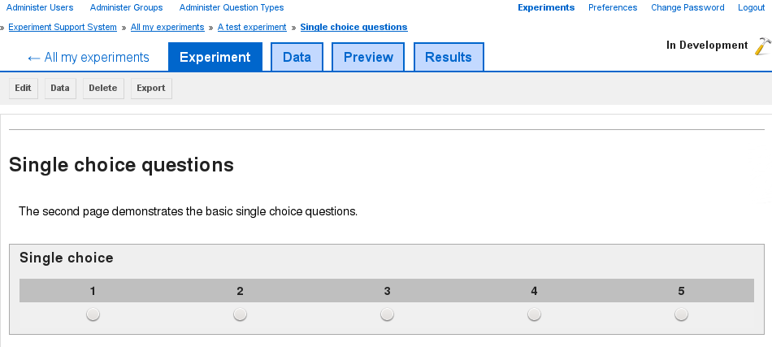

Previewing a page
-----------------

You can reach the preview page by clicking on the page's title on the
experiment page (see :doc:`edit_experiment`) or by clicking on the "preview"
button on the edit page (see :doc:`edit_page`).

.. _fig-preview-page:

   
   **Figure 1**: The preview shows the page as the experiment :term:`participants` will see it

On the preview page (`figure 1 <#fig-preview-page>`_) you are shown the experiment
:term:`page` as it will be shown to the experiment participants. The page is
fully functional with one exception and if you have configured it to use
:term:`data items`, then a sample selection will be loaded. However, no
:term:`permutation sets` will be loaded, so any page using one of those will
show placeholders instead of the :term:`permutation set` data. If you wish to
try out an experiment with :term:`permutation sets`, then you need to change
the experiment into "test" mode (see :doc:`experiment_status`).
