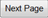
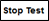
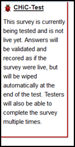

.. note::
	
   The following chapter assumes that you now know how to navigate to a specific survey on the relevant list or to a specific question in that survey. If you are not sure how to do this, please refer to the section *Navigating within PyQuestionnaire*, located at the bottom-half of the part :doc:`Access PyQuestionnaire<access_Questionnaire>`.
   
.. _runSurveySection:

Running a survey 
================

.. manipulation buttons/navigation tabs
.. |test| image:: ../_static/user/testButton.png
.. |start| image:: ../_static/user/startButton.png
.. |testSurv| image:: ../_static/user/testSurvey.png
.. |finishSurvey| image:: ../_static/user/finishSurvey.png
.. |testAgain| image:: ../_static/user/testAgainLink.png
.. |testSurvButton| image:: ../_static/user/testSurveyButton.png
.. |results| image:: ../_static/user/resultsButton.png
.. |surveyButton| image:: ../_static/user/surveyButton.png
.. |allSurveys| image:: ../_static/user/allMySurveysLink.png
.. |stopTest| image:: ../_static/user/stopTest.png
.. |pause| image:: ../_static/user/pauseButton.png
.. |finish| image:: ../_static/user/finishButton.png
.. |restart| image:: ../_static/user/restartButton.png

This chapter explains the following:

 1. how to test a survey - go to relevant section by clicking :ref:`here<testingSurvey>`. 

 2. how to stop the test running - go to relevant section by clicking :ref:`here<stopingTest>`. 

 3. how to start a survey - go to relevant section by clicking :ref:`here<startingSurvey>`. 

 4. how to pause or close a survey - go to relevant section by clicking :ref:`here<pausingSurvey>`. 
 
 5. how to re-start a survey - go to relevant section by clicking :ref:`here<restartingSurvey>`.
 
.. _testingSurvey:

Testing a survey
----------------
Before you go live with your survey, it is a good idea to test it. The test run will allow answers to be validated and recorded as if the survey was live, but will be wiped automatically at the end of the test. You will also be able to complete the survey multiple times.

- Navigate to the **home page** (:doc:`ref<conceptsAndTerms>`) of the survey you want to test (see **Note** at the top of this section).

- To test the survey you have developed, click on |test| button, included in the **Manipulation buttons** (:doc:`ref<survey_home_page_elements>`) of that screen.

- After clicking on the above button, you will be directed to the survey's first page, an example of which is illustrated below:

.. image:: ../_static/user/testSurvey.png
   :align: center

- You will then be allowed to complete the survey, as if it was live. The button |nextPage| will appear at the end of every page of the survey you are testing, allowing you to move to the next page, as if in the live survey. This functionality will help you identify whether a survey page is working as is supposed to.

- Following completion of all the questions in the survey, you will be directed to the **Thank you** screen, advising you that the survey is now complete. Click on the |finishSurvey| button to end the survey.

- You will be directed to the **Completed** screen, an example of which is shown below:

.. image:: ../_static/user/testCompleteScreen.png
   :align: center
	
- This screen allows you to test the survey again by entering more data. Do this by clicking on the link |testAgain| and repeat testing for as many times as you deem appropriate.

- When you are done testing your survey, hover over the red bug on the left top corner of your screen. This will make the following message appear next to the title of the survey page:

- Then click on the underlined survey title, next to the bug, and you will led back to the survey's **home page** (:doc:`ref<conceptsAndTerms>`). 

- If you decided that you want to add more data in the survey by testing it again, at a later stage, click on the |testSurvButton| tab, above the *Manipulation buttons* (:doc:`ref<survey_home_page_elements>`).

- This will direct you to the first page of the survey, where you can enter more data as described above.

- Should you wish to have a look at how the results of the survey are recorded, click on the |results| tab, next to the the |testSurvButton| tab mentioned above.

- By clicking on that tab, you should have been directed to the **Results** screen, a screenshot of which is provided below. An explanation of the *Results* screen is given in :doc:`Downloading, creating, uploading and clearing data and datasets<get_data>`: 
 
.. image:: ../_static/user/resultsScreen.png
   :align: center

- To navigate back to the **home page** (:doc:`ref<conceptsAndTerms>`) of your survey, click on the |surveyButton| tab, located above the |results| tab. Otherwise, if you want to navigate your list of surveys, click on the link |allSurveys|, next to the |surveyButton| tab. 

:ref:`back to the top <runSurveySection>`

.. _stopingTest:

Stopping survey testing 
-----------------------
There are three ways to stop a survey depending on where in the system you are.

**1.** If you are in the **Results** screen of the survey you are testing:

   **1.1.** Hover over the title **Testing** next to red bug, as indicated in the screenshot below, and a |stopTest| message will appear.
 
		.. image:: ../_static/user/resultsStopTest.png
				:align: center

   **1.2.** Click on that message and you will be led back to the **home page** (:doc:`ref<conceptsAndTerms>`) of the survey you are developing. As shown in the screenshot below, the status of the survey should have changed to **In development** with a little hammer next to it:

		.. image:: ../_static/user/homePageInDevelopment.png
				:align: center

**2.** If you are in the **home page** (:doc:`ref<conceptsAndTerms>`) of the survey you are testing:

   **2.1.** Click on the |stopTest| button, which now appears as part of the *Manipulation buttons* (:doc:`ref<survey_home_page_elements>`) above the title of the survey.
   
   **2.2.** As mentioned in the above option, this will lead you back to the survey's **home page** (:doc:`ref<conceptsAndTerms>`) and its status has now changed to **In development**. In addition to that, notice in the screenshot below that the |test| and |start| buttons have now replaced the |stopTest| button in the *Manipulation buttons* (:doc:`ref<survey_home_page_elements>`) above the title of the survey.

**3.** If you are in the **main profile** screen (:doc:`ref<conceptsAndTerms>`), find the correct survey from your list of surveys and click on the |stopTest| button from the set of buttons available. An example of this is shown below:

   .. image:: ../_static/user/stopTestSurvey.png
           :align: center
 
   **3.1.** After clicking on that button, you will be directed to the survey's **home page** (:doc:`ref<conceptsAndTerms>`), where you can carry on editing the survey or starting the survey as shown below.

:ref:`back to the top <runSurveySection>`

.. _startingSurvey: 

Starting a survey
-----------------
There are two ways to start a survey depending on where in the system you are.

**1.** If you are in the survey you are testing, click on the |start| button, which now appears as part of the **Manipulation buttons** (:doc:`ref<survey_home_page_elements>`) above the title of the survey. The screenshot below shows you where this button is located:

 .. image:: ../_static/user/startSurveyHome.png
		 :align: center
		 
**2.** If you are in the **main profile screen** (:doc:`ref<conceptsAndTerms>`), find the correct survey from your surveys list and click on the |start| button from the set of buttons available. An example of this is provided below:

 .. image:: ../_static/user/startSurvey.png
		 :align: center
		 
**3.** Whichever way you click on the above mentioned button, you will be directed to the **home page** (:doc:`ref<conceptsAndTerms>`) of the survey running, an example of which is given below. 

.. image:: ../_static/user/runningSurvey.png
   :align: center
    
**4.** On that screen, you will be notified of the live link for the survey (indicated by an oval with dotted borders) and that the survey's status has now changed to *Running* (indicated by a rectangular with dotted borders). 

**5.** Distribute the live link to the experiment participants. Note that as more participants complete your survey, the **Participant** data in the *Stats* table on the right of the survey's **home page** (:doc:`ref<conceptsAndTerms>`) will change. The *Stats* table is indicated in the image above by a rectangular with dotted borders.

:ref:`back to the top <runSurveySection>`

.. _pausingSurvey: 

Pausing or finishing a survey
-----------------------------
Following the starting of a survey, the **Manipulation buttons** (:doc:`ref<survey_home_page_elements>`) on the survey's **home page** (:doc:`ref<conceptsAndTerms>`) have now slightly changed to include the |pause| and the |finish| buttons.

**1.** To pause the survey:

 **1.1.** Click on the |pause| button. This will enable you to make changes to the survey without any participants answering questions that have or are likely to change.
 
 **1.2.** Following the click of the |pause| button, you will be taken back to the survey's home page, where the status of the survey would now show as **Paused**, as shown in the example screenshot below:
 
    .. image:: ../_static/user/pausedSurvey.png
			:align: center 
 
 **1.3.** Following the pause of your survey and any changes you have possibly carried out, you can then re-activate it by clicking on the |restart| button that has now appeared in the position of the |pause| button.

**2.** To stop your survey from running:

 **2.1.** Click on the |finish| button, of the **Manipulation buttons** (:doc:`ref<survey_home_page_elements>`).
 
 **2.2.** You will be led to the **Results** screen, with the status of survey now changed to **Finished**:
 
    .. image:: ../_static/user/finishedSurvey.png
			:align: center

**3.** You can also pause or stop your survey from running, from the **main profile** screen (:doc:`ref<conceptsAndTerms>`), by finding the survey in the list provided and clicking the |pause| and the |finish| buttons available.

:ref:`back to the top <runSurveySection>`

.. _restartingSurvey: 

Re-starting a survey
--------------------
**1.** After stopping the survey, you can also re-start it, should you need to gather more data for your experiment.
 
**2.** As with most functionalities of this system, there are two ways doing this, depending on where in the system you are:

   **2.1.** If you are in the **main profile screen** (:doc:`ref<conceptsAndTerms>`):

	  **2.1.a.** Find the finished survey from your list of surveys.
	  
	  **2.1.b.** Click on the |restart| button available next to the survey's title, as shown below:
	  
	     .. image:: ../_static/user/restartSurvey.png
			     :align: center 
	  
	  **2.1.c.** This will re-start the finished survey and take you to its **home page** (:doc:`ref<conceptsAndTerms>`). From this point onwards, simply follow the instructions above for :ref:`pausing or stopping the survey<pausingSurvey>`.
	  
   **2.2.** If you are in the survey's **home page** (:doc:`ref<conceptsAndTerms>`), click on the |restart| button of the **Manipulation buttons** (:doc:`ref<survey_home_page_elements>`). This will change the status of the survey to **Running** and provide with a link to distribute to the survey's participants.

:ref:`back to the top <runSurveySection>`