.. note::
	
   The following chapter assumes that you now know how to navigate to a specific survey on the relevant list or to a specific question in that survey. If you are not sure how to do this, please refer to the section *Navigating within PyQuestionnaire*, located at the bottom-half of the part :doc:`Access PyQuestionnaire<access_Questionnaire>`.

****************
Running a survey
****************

.. manipulation buttons/navigation tabs
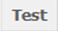
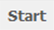
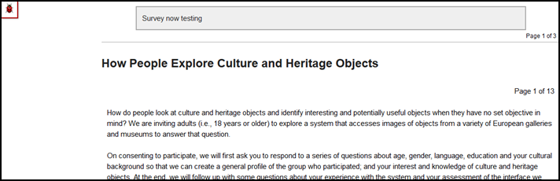
.. |finishSurvey| image:: ../_static/user/finishSurvey.png
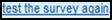
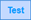
.. |results| image:: ../_static/user/resultsButton.png
.. |surveyButton| image:: ../_static/user/surveyButton.png
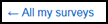
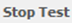
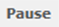
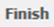
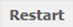

This chapter explains the following:

 1. how to test a survey - go to relevant section by clicking :ref:`here<testingSurvey>`. 

 2. how to stop the test running - go to relevant section by clicking :ref:`here<stopingTest>`. 

 3. how to start a survey - go to relevant section by clicking :ref:`here<startingSurvey>`. 

 4. how to pause or close a survey - go to relevant section by clicking :ref:`here<pausingSurvey>`. 
 
.. _testingSurvey:

Testing a survey
====================
Before you go live with your survey, it is a good idea to test it. The test run will allow answers to be validated and recorded as if the survey was live, but will be wiped automatically at the end of the test. You will also be able to complete the survey multiple times. 

- Navigate to the **home page** (:doc:`ref<conceptsAndTerms>`) of the survey you want to test (see **Note** at the top of this section).

- To test the survey you have developed, click on |test| button, included in the **Manipulation buttons** (:doc:`ref<survey_home_page_elements>`) of that screen.

- After clicking on the above button, you will be directed to the survey's first page, an example of which is illustrated below:

- You will then be allowed to complete the survey, as if it was live. This will help you identify errors such as the survey allowing you to move to the next page although you have not answered a required question in a previous page, or typing information in a field that does not follow the proper syntax specified for that field.

- Following completion of all the questions in the survey, you will be directed to the **Thank you** screen, advising you that the survey is now complete. Click on the |finishSurvey| button to end the survey.

- You will be directed to the **Completed** screen, an example of which is shown below:

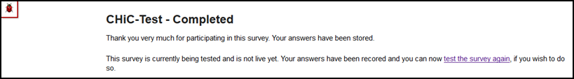
	
- This screen allows you to test the survey again by entering more data. Do this by clicking on the link |testAgain|.

- Repeat for as many times as you deem appropriate.

- When you are done entering data in your survey, to navigate to its **home page** (:doc:`ref<conceptsAndTerms>`), click on its title. This is part of the **Breadcrumbs** located above the red-coloured box advising you that *"The survey is currently being tested..."*. 

- By doing so, you will be led back to the survey's **home page** (:doc:`ref<conceptsAndTerms>`). 

- If you have decided that you want to add more data in the survey, at a later stage, click on the |testSurvButton| button, above the *Manipulation buttons* (:doc:`ref<survey_home_page_elements>`) of the **home page** screen (:doc:`ref<conceptsAndTerms>`). These buttons are located on the top half of the **home page** screen (:doc:`ref<conceptsAndTerms>`).

- This will direct you to the first page of the survey, where you can enter more data as described above.

- Should you wish to have a look at how the results of the survey are recorded, click on the |results| button, included in the *Navigation tabs* (:doc:`ref<survey_home_page_elements>`) of the **home page** screen (:doc:`ref<conceptsAndTerms>`). These tabs are located on the top half of the **home page** screen (:doc:`ref<conceptsAndTerms>`).

- You should have been directed to the screen demonstrated below. An explanation of the *Results* screen will be given in the *Downloading, uploading and clearing data* section of this manual (:doc:`ref<get_data>`):

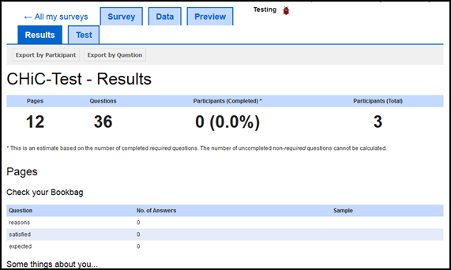

- To navigate back to the **home page** (:doc:`ref<conceptsAndTerms>`) of your survey, click on the |surveyButton| button, located next to the |results| button mentioned above. Otherwise, if you want to navigate your list of surveys, click on the link |allSurveys|, next to the |surveyButton| button. 

.. _stopingTest:

Stopping survey testing 
====================
There are two ways to stop a survey depending on where in the system you are.

- If you are in the survey you are testing, click on the |stopTest| button, which now appears as part of the *Manipulation buttons* (:doc:`ref<survey_home_page_elements>`) above the title of the survey.

- If you are in the main profile screen (:doc:`ref<conceptsAndTerms>`), find the correct survey from the list provided and click on the |stopTest| button from the set of buttons available.
 
In any case, by clicking on the above mentioned button, you will be directed to the survey's **home page** (:doc:`ref<conceptsAndTerms>`), where you can carry on editing the survey or starting the survey as shown below.

.. _startingSurvey: 

Starting a survey
====================
As with the previous section, there are two ways to start a survey depending on where in the system you are.

- If you are in the survey you are testing, click on the |start| button, which now appears as part of the **Manipulation buttons** (:doc:`ref<survey_home_page_elements>`) above the title of the survey.

- If you are in the **main profile screen** (:doc:`ref<conceptsAndTerms>`), find the correct survey from the list provided and click on the |start| button from the set of buttons available.

- Whichever way you click on the above mentioned button, you will be directed to the **home page** (:doc:`ref<conceptsAndTerms>`) of the survey running, an example of which is given below. 

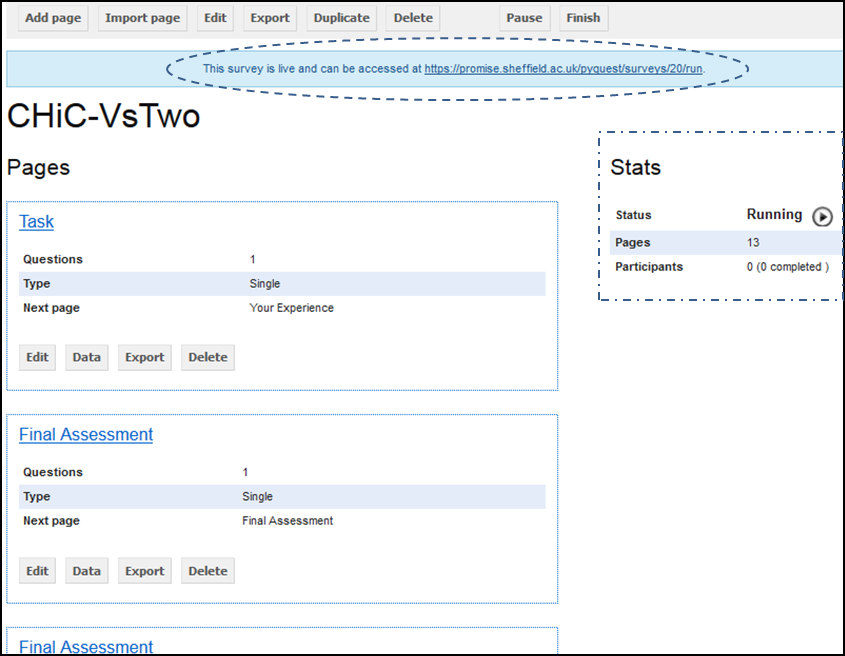
    
- On that screen, you will be notified of the live link for the survey (indicated by an oval with dotted borders) and that the survey's status has now changed to *Running* (indicated by a rectangular with dotted borders). 

- Distribute the live link to the experiment participants. Note that as more participants complete your survey, the **Participant** data in the *Stats* table on the right of the survey's **home page** (:doc:`ref<conceptsAndTerms>`) will change. The *Stats* table is indicated in the image above by a rectangular with dotted borders.

.. _pausingSurvey: 

Pausing or finishing a survey
====================
Note that the **Manipulation buttons** (:doc:`ref<survey_home_page_elements>`) on the survey's **home page** (:doc:`ref<conceptsAndTerms>`) have now slightly changed to include the |pause| and the |finish| buttons.

- To pause the survey, simply click on the |pause| button. This will enable you to make changes to the survey without any participants answering questions that have or are likely to change. 

- Following the pause of your survey, you can then re-activate it by clicking on the |restart| button that has now appeared in the position of the |pause| button. 

- To stop your survey from running, click on the |finish| button. This will take you to the **Results** screen, an example screenshot of which has been given further above, in the end of the sub-section :ref:`testingSurvey`. As mentioned above, an explanation of the **Results** screen will be given in the **Downloading, uploading and clearing data** section of this manual (:doc:`ref<get_data>`).

- You can also pause or stop your survey from running, from the **main profile screen** (:doc:`ref<conceptsAndTerms>`), by finding the survey in the list provided and clicking the |pause| and the |finish| buttons available.
