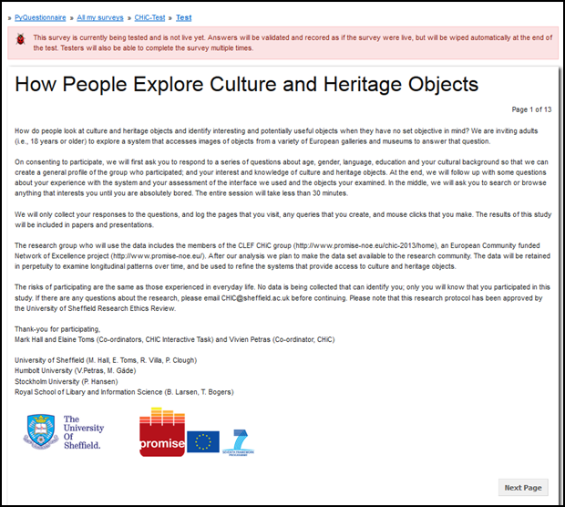
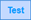
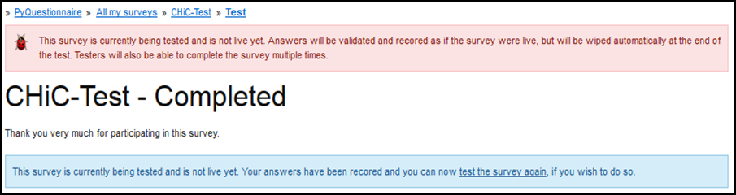

Running a survey (Test/Start)
----------------
.. manipulation button
.. |test| image:: ../_static/user/testButton.png
.. |start| image:: ../_static/user/startButton.png

.. |finishSurvey| image:: ../_static/user/finishSurvey.png
.. |testAgain| image:: ../_static/user/testAgainLink.png

.. |results| image:: ../_static/user/resultsButton.png

Testing a survey
****************
Before you go live with your survey, it is a good idea to test it. The test run will allow answers to be validated and recorded as if the survey was live, but will be wiped automatically at the end of the test. You will also be able to complete the survey multiple times. 

- Navigate to the home page of the survey you want to test (refer to the last paragraph of the *Access PyQuestionnaire* section(:doc:`ref<access_Qnnaire>`) on how to do this).

- To test the survey you have developed, click on |test| button, included in the *Manipulation buttons* (:doc:`ref<survey_home_page_elements>`) of that screen.

- After clicking on the above button, you will be directed to the survey's first page, an example of which is illustrated below:

- You will then be allowed to complete the survey, as if it was live. This will help you identify errors such as the survey allowing you to move to the next page although you have not answered a required question in a previous page, or typing information in a field that does not follow the proper syntax specified for that field.

- Following completion of all the questions in the survey, you will be directed to the *Thank you* screen, advising you that the survey is now complete. Click on the |finishSurvey| button to end the survey.

- You will be directed to the *Completed* screen, an example of which is shown below:

	
- This screen allows you to test the survey again by entering more data. Do this by clicking on the link |testAgain|.

- Repeat for as many times as you deem appropriate.

- When you are done entering data in your survey, to navigate to its **home page**, click on its title. This is part of the **Breadcrumbs** located above the red-coloured box advising you that *"The survey is currently being tested..."*. 

- By doing so, you will be led back to the survey's **home page**. 

- If you have decided that you want to add more data in the survey, click on the |testSurvButton| button, above the *Manipulation buttons* (:doc:`ref<survey_home_page_elements>`) of the **home page** screen. These buttons are located on the top half of the **home page** screen.

- This will direct you to the first page of the survey, where you can enter more data as described above.

- Should you wish to have a look at how the results of the survey are recorded, click on the |results| button, included in the *Navigation tabs* (:doc:`ref<survey_home_page_elements>`) of the **home page** screen. These tabs are located on the top half of the **home page** screen.

- By clicking on the 

Starting a survey
****************
- Click on the |start| button to
