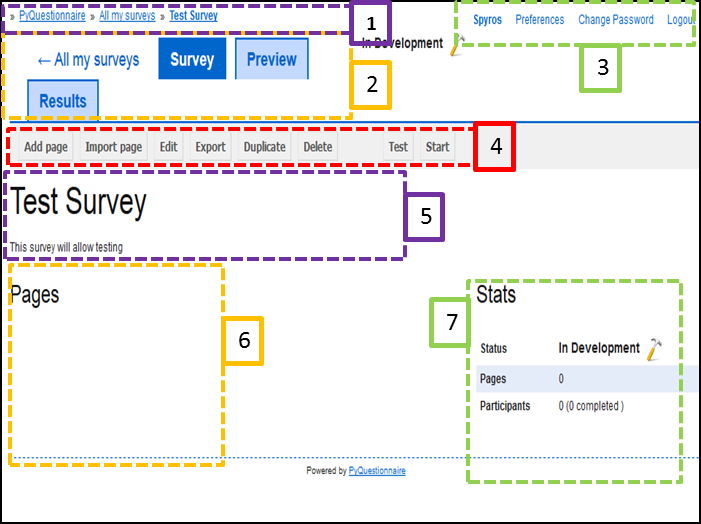

Survey home page elements
-------------------------
The following elements constitute the survey home page and are demonstrated in the screenshot after the table below:

.. csv-table::
   :header: "Element number", "Element title", "Element description"
   :widths: 15, 15, 250
   
	"**(1)**", "Breadcrumbs", "Allows you to identify their whereabouts in the system"
	"**(2)**", "Navigation tabs", "**These include**:
	*All my Surveys*: By clicking on this link, you are directed to the list of surveys you have previously created, run or are in the process of developing.
	
	*Survey*: While in a survey under development, this button merely indicates that you are located in the home page of that survey. Note that this button has a dark blue background, distinguished in this way by the *Preview* button next to it.
	
	*Preview*: By clicking on this button, you will be directed to a preview of the survey under development.
	
	*Results*: By clicking on this button, you will be directed to the *Results* page consisting of a summary of key survey information. This page includes: 
	  
	**1.** The number of pages the survey includes
	
	**2.** The number of questions included
	
	**3.** The estimated number of participants that will complete the survey, based on the number of completed required questions.
	
	**4.** The total number of participants that have actually completed the survey."
	"**(3)**", "Account links", "**These include**: 
	**1.** The *username* you have previously chosen. By clicking on the *username* link, you will be directed to the list of the surveys you have run in the past or are currently developing.
	
	**2.** Upon clicking on the link *Preferences*, you will be directed to the *Edit* screen where you can amend their *Display Name* and the *E-mail* address the system is using to contact them. You can also choose for *tooltips* to appear when hovering the cursor over an element of the web page.
	
	**3.** The link *Change Password* directs you to the relevant screen, allowing the change of the password previously used. 
	
	**4.** Clicking on the link *Logout* will allow you to logout of the system."
	"**(4)**", "Manipulation buttons", "**These include** the following buttons that enable you to manipulate the survey under development:*Add Page*, *Import Page*, *Edit*, *Export*, *Duplicate*, *Delete*, *Test*, *Start*. The function of each button is explained in the next section of this manual."
	"**(5)**", "Survey information", "This screen element provides the title of the survey and detailed information on its purpose."
	"**(6)**", "Survey pages", "The pages that a survey has will be shown in this element."
	"**(7)**", "Survey statistics", "This elements shows to the User:
	**1.** the status of the survey (i.e. *In Development*, *Running*, *Paused*, *Finished*, *Testing*)
	
	**2.** the number of pages included in the survey
	
	**3.** how many participated in the survey and, of those, how many completed it."

An example screenshot of the home page screen. Each element number, in the table above, corresponds to the section of the home page using the same number: 

   
    